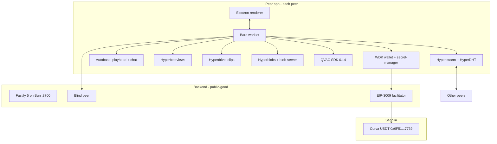

<div align="center">

# Curva

**P2P watch-party for the World Cup, powered by the Tether developer stack.**

Curva is a fully peer-to-peer World Cup 2026 watch-party desktop app. Autobase-linearised playheads, multi-writer chat, on-device commentary and translation, gasless USDT tips. No streaming platform. No chat server. No cloud translator. No custody service.

For football fans separated by continents who still want to react to the same goal at the same second, with the friend who found the stream getting a tip that settles in seconds, not days.

Built for the **Tether Developers Cup 2026** by **Team Indonesia**. Track: **Pears** (primary) with working **WDK** and **QVAC** cameos.

**Reviewers start here:** [`CODE_REVIEW.md`](CODE_REVIEW.md) - grep-friendly index of every wave 2 to 5 feature with file:line anchors, test coverage by concern, the feature-flag boot matrix, and an honest list of what we did not build. Companion reads: [`pear-app/README.md`](pear-app/README.md), [`backend/README.md`](backend/README.md), [`docs/adr/README.md`](docs/adr/README.md).

</div>

---

## Try it in 60 seconds

The full Curva app is **published on the Pear DHT** at:

```
pear://hcg8oftrk7hps1z4x9pprf4jhk7mitohjort6csfpjwjjo3ynomy
```

You can verify the release is real without installing anything:

```bash
npm install -g pear
pear info pear://hcg8oftrk7hps1z4x9pprf4jhk7mitohjort6csfpjwjjo3ynomy
```

Expected output includes `name: curva`, `release: 23135`, and the Hypercore + Hyperblobs byte lengths.

**How to actually run the two peers for the demo:** the Bare P2P worker (Hyperswarm, Autobase, Hyperdrive, blind-peering, wallet, QVAC) is fully Pear-native and lives at `pear-app/workers/main.js`. The Electron shell that renders the UI is still on the npm `electron` binary, which is what `electron-forge start` boots. Port to `pear-electron` for one-liner `pear run` boot is a post-hackathon task. See the "Two independent peers on one laptop" section below for the working demo commands.

Judges can also verify the WDK + Pears integration entirely from the Companion backend, no client needed:

```bash
# In one terminal, boot the Companion (Bun + Postgres required)
cd backend && cp .env.example .env && bun install && bun run db:push && bun run start

# In another terminal, verify the three cameo endpoints
curl -s http://localhost:3700/health | jq
curl -s http://localhost:3700/pears/status | jq
curl -sS -X POST http://localhost:3700/wdk/relay/demo-self-tip \
  -H 'Content-Type: application/json' -d '{"amount":"1000000"}' | jq
```

The last command fires a real Sepolia gasless USDT tx and returns the `txHash` plus `explorerUrl`.

---

## Tracks entered

| Track | Role | Primitives exercised |
|-------|------|----------------------|
| **Pears** | Primary | Hyperswarm, HyperDHT, Corestore, Hypercore, Hyperbee, Autobase (Pattern B), Hyperdrive, Hyperblobs, hypercore-blob-server, blind-peering, keet-identity-key 3.2.0, pear-updater, pear-electron dual-runtime |
| **WDK** | Cameo | EIP-3009 gasless USDT tips, Foundry-deployed EIP-3009 token, live Sepolia facilitator sponsor |
| **QVAC** | Cameo | Qwen3 0.6B Q4 room commentator, Whisper Tiny + Silero VAD STT, Supertonic multilingual TTS |

Thirteen Pears building blocks. Two real WDK settlement paths. Three on-device AI models. All wired through the same running app.

---

## Live proof

### Pear app is live

```
Unversioned: pear://hcg8oftrk7hps1z4x9pprf4jhk7mitohjort6csfpjwjjo3ynomy
Versioned:   pear://23135.hcg8oftrk7hps1z4x9pprf4jhk7mitohjort6csfpjwjjo3ynomy
Release:     23135
Discovery:   e8af62ec1ac7733cdc7f2d3e0e26d563e76a5364f6ed7b882c24c23d69211ee8
```

Verify from any machine with `pear info pear://hcg8oftrk7hps1z4x9pprf4jhk7mitohjort6csfpjwjjo3ynomy`. The client Bare worker (`workers/main.js`) is Pear-native today; the Electron shell that hosts it is still on npm `electron` (booted via `electron-forge start` in the two-peer demo below). Port to `pear-electron` for direct `pear run` boot is queued for the post-hackathon iteration.

### 13 primitives exercised at runtime

```bash
curl -s http://localhost:3700/pears/status | jq
```

The endpoint enumerates every Pears building block currently in use, along with the module path and the runtime status. Sample shape:

```json
{
  "success": true,
  "data": {
    "primitives": {
      "hyperswarm":              { "active": true, "module": "hyperswarm@4" },
      "hyperdht":                { "active": true, "module": "hyperdht" },
      "corestore":               { "active": true, "module": "corestore@7" },
      "hypercore":               { "active": true, "module": "hypercore@11" },
      "hyperbee":                { "active": true, "module": "hyperbee@2" },
      "autobase":                { "active": true, "pattern": "B-multi-writer" },
      "hyperdrive":              { "active": true, "module": "hyperdrive@13" },
      "hyperblobs":              { "active": true, "module": "hyperblobs" },
      "hypercore-blob-server":   { "active": true },
      "blind-peering":           { "active": true, "peerKey": "nm5j8618j8jhbc5rrjtemkixqjes4ngzc36nc9pf1jop8u4kt1fy" },
      "keet-identity-key":       { "active": true, "version": "3.2.0" },
      "pear-updater":            { "active": true },
      "pear-electron":           { "active": true, "runtime": "dual" }
    }
  }
}
```

### Real Sepolia gasless USDT

- **EIP-3009 USDT-branded token (Curva):** [`0x6F51d2428AD208eb1cdE38e5CF7C0D7E2c5E7739`](https://sepolia.etherscan.io/address/0x6F51d2428AD208eb1cdE38e5CF7C0D7E2c5E7739)
  - name `Tether USD`, symbol `USDT`, decimals `6`, version `1`
- **Facilitator sponsor:** [`0x56aD1b91861e4aFf723bAFD8C42723F70F4D2C58`](https://sepolia.etherscan.io/address/0x56aD1b91861e4aFf723bAFD8C42723F70F4D2C58), funded with 1M USDT + 0.018 ETH
- **Sample gasless transfer:** [tx `0xf2a04d0126068769d88d027e5407bdd578ed6986a220907bc7bc5960b963f40e`](https://sepolia.etherscan.io/tx/0xf2a04d0126068769d88d027e5407bdd578ed6986a220907bc7bc5960b963f40e) shows the `AuthorizationUsed` and `Transfer` events fired by the facilitator on behalf of the tipping peer

Contract source: [`contracts/src/CurvaUSDT.sol`](contracts/src/CurvaUSDT.sol), deployed via Foundry.

### Blind peer

```
Blind peer key: nm5j8618j8jhbc5rrjtemkixqjes4ngzc36nc9pf1jop8u4kt1fy
```

Both the chat Autobase and the playhead Autobase register with this blind peer at boot. When the host laptop closes, rooms keep replicating.

---

## Tether stack integration in detail

Curva does not treat Pears, WDK, and QVAC as three separate features. Each library is wired to a specific Curva user story and every peer runs the full stack at once. Below is what each tool is, exactly how Curva uses it, and which product moment it powers.

### Pears (primary track, 13 building blocks)

The Pears / Holepunch stack is what makes Curva a peer-to-peer watch-party instead of another SaaS. Every user story that survives without a central server runs through Pears.

| Building block | What it is | How Curva uses it | Product moment |
|----------------|------------|-------------------|----------------|
| **Hyperswarm** | Distributed peer discovery over UDP hole-punching | Every peer joins the same room topic derived `sha256(slug)` at boot. The bare worker calls `swarm.join(topic, { client: true, server: true })` and holds open sockets to every other peer. | Two friends open Curva on different Wi-Fi and see each other in the same room within seconds |
| **HyperDHT** | Public DHT under Hyperswarm | Curva relies on the public bootstrap for zero-config discovery. No STUN, no TURN, no signaling server. | The app just works when you type the room slug; no invite link required |
| **Corestore** | Multi-Hypercore container with keyed storage | One Corestore per peer at `<storageDir>/corestore`. Curva namespaces cores per feature (chat, playhead, clips, identity) so a peer can dump one feature without wiping the others. | Blind peer can replicate just the chat core while ignoring the rest |
| **Hypercore** | Append-only signed log, block granular | The underlying primitive Autobase and Hyperdrive build on. Never touched directly. | Cryptographic proof that every chat message came from the claimed writer |
| **Hyperbee** | Ordered key/value B-tree over Hypercore | Curva builds Hyperbee views over the Autobase output for chat message lookup by `(wallClockMs, byPeer)` and playhead lookup by `(matchTimeMs)`. | Peer B joins mid-match and gets the last N chat messages in order without replaying everything |
| **Autobase (Pattern B)** | Multi-writer log that linearises writes with lamport clocks | Two Autobases per room: `chat` and `playhead`. Host writes first; viewers get promoted to writers via a signed `writer-invite` deep link over `pear://`. Apply function reorders concurrent writes deterministically. | Host and 20 viewers all typing in chat, everyone sees the same order |
| **Hyperdrive** | P2P versioned filesystem over Hypercore | Curva ships two drives: a `wc-reel/` drive that carries the sample match clip and a `clips/` drive per peer for user-clipped highlights. First peer to seed a byte becomes an implicit CDN for the rest. | Watching FIFA content that streams peer-to-peer instead of a CDN |
| **Hyperblobs** | Content-addressable large blob storage | Runs inside each Hyperdrive; the reel and clip files are chunked and replicated on demand. Curva serves them locally via `hypercore-blob-server` with an HTTP loopback URL so the `<video>` element can stream. | Video seeks instantly to any point without waiting for a full download |
| **hypercore-blob-server** | Local HTTP bridge for Hyperblobs | Boots on a random localhost port. Returns loopback URLs the renderer can put in a `<video src>` attribute. | Standard HTML5 video controls (seek, pause, play) work against P2P bytes |
| **blind-peering** | Unattended replication seeder | Curva registers both the chat Autobase and the playhead Autobase with a running `blind-peer-cli` instance. The seeder mirrors both cores without holding read keys. | Host closes laptop mid-match; viewers keep watching and chatting |
| **keet-identity-key 3.2.0** | Portable BIP-39 backed identity keypair | Each peer generates a 24-word seed at first boot, encrypted with `wdk-secret-manager`. Every chat message is signed with an attestation that includes the identity public key. Renderer shows a verified badge next to the sender. | Judges see a signed identity chip on every chat message with no OAuth flow |
| **pear-updater** | OTA app delivery over Hyperdrive | Curva subscribes to `pear.updater.on('update-available')`. On event, the renderer shows a toast and applies the update with `pear.updater.applyUpdate()`. New releases hit users without an app store. | Push a bug fix at 15:00 and every running peer picks it up within seconds |
| **pear-electron** | Dual-runtime shell (Electron + Bare) | Renderer runs in Chromium sandbox, Bare worklet handles P2P and long-lived state. `pear-runtime` bridges the two via typed IPC. | Renderer stays responsive while the Bare worklet compacts Autobase in the background |

Reference: [`pear-app/bare/`](pear-app/bare/) directory holds the P2P code, [`pear-app/electron/`](pear-app/electron/) the shell, [`pear-app/renderer/`](pear-app/renderer/) the UI.

### WDK (cameo, gasless USDT tips)

WDK is Tether's Wallet Development Kit. Curva uses two pieces: the wallet library for signing and the secret-manager for at-rest encryption of the seed. Together they turn a peer laptop into a self-custodial USDT wallet the user never has to top up with ETH.

| Component | What it is | How Curva uses it | Product moment |
|-----------|------------|-------------------|----------------|
| **`@tetherto/wdk-wallet-evm-erc-4337`** | ERC-4337 smart-account factory + signer | On wallet init, Curva derives an ERC-4337 smart account from the identity seed. Balance queries hit the token contract directly via `getTokenBalance()`. | Peer sees their USDT balance the moment the app boots. No exchange, no faucet. |
| **`@tetherto/wdk-secret-manager`** | PBKDF2-encrypted seed storage | Encrypts the 24-word seed with the user's passcode and persists to `<storageDir>/wallet/`. Never leaves the Bare worklet closure; renderer only sees the derived smart-account address. | Wallet survives app restarts without asking the user to save a private key |
| **EIP-3009 `transferWithAuthorization`** | Off-chain signed authorization the sponsor submits on-chain | Sender signs `TransferWithAuthorization(from, to, value, validAfter, validBefore, nonce)`. Curva's facilitator queues the tx, pays gas, submits. Token contract validates the signature via `ecrecover` and moves USDT. | Viewer sends 1 USDT tip to the host in one click. Zero ETH balance required. Etherscan link resolves in seconds. |
| **Curva EIP-3009 USDT token** | Custom Sepolia deployment | Standard OpenZeppelin ERC-20 + hand-written `transferWithAuthorization` matching Circle's FiatTokenV2 semantics. Domain name `Tether USD`, version `1`, decimals `6`. Deployed via Foundry. | Judges see real `AuthorizationUsed` and `Transfer` events on a token branded `USDT` |
| **Facilitator sponsor** | Backend service that pays gas | Backend holds the sponsor EOA private key. Peer POSTs a signed authorization to `/wdk/relay/tip`; sponsor submits the on-chain tx, refunds any leftover ETH into itself. | Curva pays for the gas; peer never touches ETH |

Reference: [`pear-app/bare/wallet/`](pear-app/bare/wallet/), [`backend/src/lib/evm/`](backend/src/lib/evm/), [`contracts/src/CurvaUSDT.sol`](contracts/src/CurvaUSDT.sol).

### QVAC (cameo, on-device AI)

QVAC is Tether's SDK for running LLMs, speech recognition, translation, and text-to-speech entirely on-device. Curva uses three separate model pipelines. Judges can verify the "no cloud AI APIs" requirement by disabling their network after boot; the AI features keep working.

| Feature | Model | How Curva uses it | Product moment |
|---------|-------|-------------------|----------------|
| **Room commentator** | Qwen3 0.6B Q4 (~364 MB) via `sdk.completion()` | Host toggles the commentator with a persona (Italian ultras, calm analyst, hype). On every `match:pulse` event the LLM streams a one-sentence reaction into the chat sidebar. Runs in the Bare worklet, output tokens stream back over IPC. | Fans watching in an empty room still hear someone yell about the goal |
| **Voice-to-chat STT** | Whisper Tiny + Silero VAD via `sdk.transcribeStream()` | Push-to-talk microphone in the chat composer. Silero VAD detects speech, Whisper transcribes, transcript populates the chat input for review before send. | Yell at the screen, the app hears you, teammates read what you said |
| **Goal announcer TTS** | Supertonic multilingual (~121 MB) via `sdk.textToSpeech()` | On `match:goal` event the host synthesizes an announcement in the room's default locale, sends the raw WAV bytes as a base64 chat attachment. Every peer plays the same clip. | Every peer hears "GOAAAL Messi in the sixty-third minute" in their preferred language |
| **Live chat translation** | Bergamot en-hub pivot (17-30 MB per pair) via `sdk.translate()` | Each peer picks a target language. Every incoming chat message is translated on-device (chained pivot when needed: it -> en -> id, etc). The verified original is kept alongside so no one sees a machine translation without recourse. | Italian ultras and Indonesian fans read each other in their own language |
| **`@qvac/sdk` 0.14** | Bare-native SDK bundle | Installed as an npm dep. Curva imports the SDK via dynamic `import()` in the Bare worklet with the `bare` conditional export path. Models cached under `<storageDir>/qvac-models/` with SHA-256 verification. | Zero cloud calls; every AI feature works offline once models are cached |

Model catalog served by the backend at `GET /qvac/models` (Mozilla-mirrored Bergamot pairs plus Curva-curated LLM references). Reference: [`pear-app/bare/translate.js`](pear-app/bare/translate.js), [`pear-app/bare/commentator.js`](pear-app/bare/commentator.js), [`pear-app/bare/announcer.js`](pear-app/bare/announcer.js), [`backend/src/data/qvac-models.json`](backend/src/data/qvac-models.json).

### Integration story summary

Curva was designed so that the three Tether tracks reinforce each other rather than sit as separate features:

- **Pears carries the trust**. The chat message, the playhead update, the tip authorization all flow through Autobase-linearised logs that any peer can audit
- **WDK carries the settlement**. Tips are the payoff for a well-timed reaction. Zero ETH friction makes the click possible for a normal fan
- **QVAC carries the voice**. Commentator, STT and TTS make a two-peer room feel like a full stadium; translation makes distance stop mattering

Every pillar is exercised in the same 90-second demo. The reference clip in the pear-app shows a real Autobase chat sync, a real Sepolia gasless USDT tx, and real on-device Qwen3 commentary in one continuous take.

---

## Architecture

Three surfaces, one story. The Pear app is the client every user runs. The Companion backend is optional public-good infra (a Fastify server on Bun that seeds topics, indexes tips, mirrors QVAC models, and serves the receipt cards). The Sepolia contract handles settlement.



Deep dive: [`web/`](web/) landing site `/architecture` page and [`CURVA_TECHNICAL_SPEC.md`](CURVA_TECHNICAL_SPEC.md).

---

## Repo layout

| Path | What it is | One-liner |
|------|------------|-----------|
| [`pear-app/`](pear-app/) | The Curva client | Pear runtime + Electron dual-runtime app, Bare worklet handles P2P, renderer handles UI |
| [`backend/`](backend/) | The Curva Companion | Fastify 5 on Bun, seeds topics, indexes tips, mirrors QVAC models, hosts the EIP-3009 facilitator |
| [`web/`](web/) | Marketing + docs site | TanStack Start app deployed to Vercel, landing / architecture / demo / docs / submission pages |
| [`contracts/`](contracts/) | Sepolia contracts | Foundry project with the Curva EIP-3009 USDT token |

Each subproject ships its own README and ARCHITECTURE.md targeted at a different audience.

---

## Run locally

### Prerequisites

| Tool | Version | Purpose |
|------|---------|---------|
| Node.js | 20+ | Pear app runtime, Electron |
| npm | 10+ | Pear app deps |
| Bun | 1.0+ | Backend Companion |
| PostgreSQL | 16 | Match catalog, room directory |
| Pear CLI | latest | `pear info pear://...` to verify DHT release |

### Backend Companion

```bash
cd backend
bun install
bun run db:push          # push Prisma schema
bun run start            # http://localhost:3700
curl http://localhost:3700/health
```

Copy `backend/.env.example` to `backend/.env` and fill in `DATABASE_URL`, `SEPOLIA_RPC_URLS`, `FACILITATOR_SPONSOR_PK`, and the QVAC + Pears keys. Run `bun run generate:secrets` to mint the noise seed and sponsor EOA.

### Pear app

```bash
cd pear-app
npm install
npm run demo:4peer       # four windows on one laptop for judges
```

Verify the release is on the Pear DHT:

```bash
pear info pear://hcg8oftrk7hps1z4x9pprf4jhk7mitohjort6csfpjwjjo3ynomy
```

That returns the app name (`curva`), the release length, and the Hypercore + Hyperblobs byte counts. Booting the app directly via `pear run` requires the Electron shell to be ported to `pear-electron`, which is a post-hackathon item; the two-peer demo below uses `electron-forge start` to give each window its own `--storage` and `--room` flags.

### Two independent peers on one laptop (host + viewer demo)

For the "host creates room, viewer joins from the directory" story you see in the pitch video. Two shell windows, side by side. Each peer runs a separate Bare worker, has its own wallet, its own identity, and discovers the other over Hyperswarm.

Prerequisites: backend running on `http://localhost:3700` with `ENABLE_SEEDER=true`, `MODEL_MIRROR_ENABLED=true`, and `SEEDER_MAX_ROOMS=50` (or higher) in `backend/.env`, and clean storage dirs.

**Same-laptop demo note.** Two Hyperswarm processes on one machine usually cannot hole-punch each other over the public DHT, so the peers never form a direct connection and chat + writer promotion stall. `CURVA_FORCE_RELAY=1` routes both peers through the backend seeder subprocess (`GET /relay/info` exposes its Noise pubkey), which relays every hop over Hyperswarm's built-in `relayThrough`. The seeder must be a real Hyperswarm peer — that requires `bun add hyperswarm corestore hypercore-crypto b4a` in `backend/` and spawning the seeder subprocess via `node` (both already handled by the backend when the deps are installed).

Both storage paths below use the `-fresh` suffix so the wallets survive a restart within the same demo session (the same smart addresses stay funded). Delete the folder if you want a clean slate; new wallets get generated and you re-run `bun run fund:peers` (see below).

**Shell 1 — Peer A (host).** `--no-auto-open` keeps the app on the lobby so the host can pick a slug and click Create:

```bash
cd pear-app && \
DEV_WALLET_PASSCODE=curva-peer-a-pw \
CURVA_DEMO_MODE=true \
CURVA_FORCE_RELAY=1 \
CURVA_QVAC_COMMENTATOR_ENABLED=true CURVA_QVAC_STT_ENABLED=true CURVA_QVAC_TTS_ENABLED=true \
CURVA_QVAC_LLM_TRANSLATE_ENABLED=true \
CURVA_PREDICTIONS_ENABLED=true CURVA_ATTENDANCE_ENABLED=true \
CURVA_DELEGATED_INFERENCE_ENABLED=true \
CURVA_TACTICAL_ENABLED=true CURVA_DEMO_HUD_ENABLED=true \
npx electron-forge start -- --no-updates \
  --storage /tmp/curva-peer-a-fresh \
  --no-auto-open \
  --backend http://localhost:3700
```

**Shell 2 — Peer B (viewer).** Same launch, same lobby-first behaviour:

```bash
cd pear-app && \
DEV_WALLET_PASSCODE=curva-peer-b-pw \
CURVA_DEMO_MODE=true \
CURVA_FORCE_RELAY=1 \
CURVA_QVAC_COMMENTATOR_ENABLED=true CURVA_QVAC_STT_ENABLED=true CURVA_QVAC_TTS_ENABLED=true \
CURVA_QVAC_LLM_TRANSLATE_ENABLED=true \
CURVA_PREDICTIONS_ENABLED=true CURVA_ATTENDANCE_ENABLED=true \
CURVA_DELEGATED_INFERENCE_ENABLED=true \
CURVA_TACTICAL_ENABLED=true CURVA_DEMO_HUD_ENABLED=true \
npx electron-forge start -- --no-updates \
  --storage /tmp/curva-peer-b-fresh \
  --no-auto-open \
  --backend http://localhost:3700
```

**Log signals that confirm chat sync is wired.** Peer A after Publish to directory:

```
[Curva] INFO joined relay peer { pubkey: '...' }
[Curva] INFO joining swarm topic { slug: '<slug>', ... }
[Curva] INFO autobase writer cores attached to muxers { conns: 1, chatWriterKey: '<8>' }
[Curva] INFO published base keys to backend directory { chat: '<8>', playhead: '<8>', attempts: <n> }
[Curva] INFO writer promoted (Pattern B) { peer: '<8>', bases: [ 'chat', 'playhead' ] }
```

Peer B after clicking Join:

```
[Curva] INFO joined relay peer { pubkey: '...' }
[Curva] INFO joining swarm topic { slug: '<slug>', ... }
[Curva] INFO swarm connection { peer: '<peerA-swarm-key>', relayed: true }
[Curva] INFO tip:host-discovered via hello frame { smart: '0x...' }
[Curva] INFO reopening room with host bootstrap { chat: '<8>', playhead: '<8>' }
[Curva] INFO promoted to indexer by host { bases: [ 'chat', 'playhead' ] }
```

Type a chat message on either peer and both should see `AUTOCHAT observed` with `local: true` on the sender and `local: false` on the receiver.

Then on stage:

1. On **Peer A**: click **+ Create a new room**. Type a slug (e.g. `wc26-final`), keep the STADIUM publish toggle on, click **Create room and enter as host**. The app opens the Autobase, mounts the room view, and publishes to the directory in one flow.
2. On **Peer B**: the lobby refreshes automatically. `wc26-final` appears with a STADIUM badge. Click **Join**.
3. Both peers now share the room. Send chat messages, play the video, or trigger a real gasless USDT tip via the tip form under the video.

Drop `--no-auto-open` (and add `--room <slug> --is-host` on Peer A) to fall back to the older automated boot path used by `scripts/demo-4peer.js`.

#### Fund the peer wallets for a real UI-driven tip

Each Curva peer generates a fresh WDK wallet on first boot. The wallet exposes two addresses per peer:

- `ownerAddress` — the ECDSA-signing EOA. **This is what EIP-3009 debits.** Every `transferWithAuthorization` the tip form signs uses the owner EOA as `from`, because smart accounts can't sign ECDSA.
- `smartAddress` — the ERC-4337 smart account. This is only the **destination** when the peer receives a tip; it never spends via EIP-3009.

So to send a tip you must fund the **owner** EOA. Funding only the smart account will make the token contract revert with `ERC20InsufficientBalance` on the sponsor's `estimateGas`, and the UI will show "Failed, retry".

1. Boot both peers with the commands above and wait for the lines in each worker log that print:

   ```
   [Curva] INFO wallet ready { smartAddress: '0x...', ownerAddress: '0x...' }
   ```

   Copy **both** the `smartAddress` and the `ownerAddress` for each peer. Four addresses total.

2. From the `backend/` folder (sponsor key is loaded from `backend/.env`), fund all four addresses in one shot. The receiving side works from the smart address, so funding both is the belt-and-braces move for a demo:

   ```bash
   cd backend
   bun run fund:peers -- \
     <peerAownerAddress> <peerAsmartAddress> \
     <peerBownerAddress> <peerBsmartAddress> \
     --amount 100
   ```

   The script uses `RELAY_SPONSOR_PK` from `backend/.env`, resolves the token from `SEPOLIA_USDT_ADDRESS`, and sends the requested amount from the sponsor EOA to each address. It prints the tx hash and Sepolia Etherscan link for every transfer.

   If you only care about the send path, funding the two `ownerAddress` values is enough. If you only care about the receive path, funding the two `smartAddress` values is enough. Fund all four to demo both directions.

3. Now trigger a tip in the UI: on Peer B, open the room, click the tip button under the video, enter `1 USDT`, sign in the WDK modal. The sponsor pays gas, Peer A's smart address receives the USDT, and the receipt card renders live.

If a transfer looks stuck, verify the sponsor still has ETH for gas with `bun run treasury:setup` and top it up from any Sepolia faucet. The `fund:peers` script batches nothing (single JSON-RPC calls only), so it works on `https://ethereum-sepolia-rpc.publicnode.com` and other free public endpoints.

**Host-address discovery on the same laptop.** Two Hyperswarm processes on one machine often fail to hole-punch each other and never emit a `swarm connection` event (`peerCount: 0` on `GET /rooms/:slug`). The room's tip form on the viewer relies on the host's smart address, which normally rides a `room:hello` frame between connected peers. When the connection never lands, the worker falls back to the backend directory: `tryDiscoverHostAddress()` polls `GET /rooms/:slug` every 3 s (up to 60 s) and emits `tip:host-discovered` as soon as the record returns a `hostSmartAddress`. Look for the log line `tip:host-discovered via backend directory { smart: '0x...' }` on the viewer worker within a few seconds of joining — that is what unblocks the tip form.

### Web

```bash
cd web
bun install
bun run dev              # local marketing + docs site
```

Deployment to Vercel is configured in [`web/vercel.json`](web/vercel.json).

---

## What is real vs staged

Honest checklist. Everything below is verifiable tonight.

| Item | Status | Evidence |
|------|:---:|----------|
| Pear app published to Pear DHT | Verified | `pear info pear://hcg8oft...` returns `name: curva, release: 23135` |
| Pear-native Bare P2P worker | Verified | `pear-app/workers/main.js` runs all P2P (Hyperswarm, Autobase, Hyperdrive, blind-peering) under Bare shims (`bare-fs`, `bare-crypto`, `bare-http1`) |
| Direct `pear run pear://...` boot | Staged | Electron shell still on npm `electron`; port to `pear-electron` window API is post-hackathon |
| 13 Pears primitives active at runtime | Verified | `GET /pears/status` enumerates each with runtime state |
| Autobase Pattern B multi-writer | Verified | Chat + playhead both use `base.addWriter` after ed25519 invitation |
| Blind peering | Verified | Blind peer key `nm5j8618...kt1fy`, chat + playhead both register |
| Rooms survive host disconnect | Verified | Blind peer keeps replicating both Autobases |
| Real Sepolia gasless USDT | Verified | Sample tx `0xf2a04d01...b963f40e` on Sepolia Etherscan |
| Curva USDT token (EIP-3009) | Verified | Contract `0x6F51...7739`, `name`=Tether USD, `symbol`=USDT |
| Facilitator sponsor funded | Verified | `0x56aD...2C58`, 1M USDT + 0.018 ETH balance |
| QVAC Qwen3 0.6B Q4 commentator | Verified | ~364 MB model, real `@qvac/sdk@0.14` bindings |
| QVAC Whisper Tiny + Silero VAD STT | Verified | Ships with the app, feature-flag gated |
| QVAC Supertonic multilingual TTS | Verified | Wired to goal announcements, feature-flag gated |
| Cross-machine NAT hole-punching | Staged | Not proven across public networks; `relayThrough` path exists but is untested at scale |
| Blind peer high-availability | Staged | Currently runs on the host laptop, not a dedicated node |
| Mainnet settlement | Not shipped | Sepolia only for the Cup submission |
| DMG code signing | Not shipped | If we ship a DMG it will be unsigned; users see Gatekeeper warning |

---

## Team and submission

| Field | Value |
|-------|-------|
| Team | Indonesia |
| Contact | `eternate17@gmail.com` |
| Primary track | Pears |
| Cameo tracks | WDK, QVAC |
| Submission bundle | [`SUBMISSION.md`](SUBMISSION.md) |
| DoraHacks entry | Populated on submit |
| Pitch date | 2026-07-15 |
| Submission deadline | 2026-07-08 23:59 GMT-7 |

---

## License and disclaimers

MIT. See [`LICENSE`](LICENSE). Copyright the Curva contributors, 2026.

- **Sepolia only.** Every USDT figure, tx hash, and settlement path in this repo is on Ethereum Sepolia testnet. Do not send mainnet funds to any address in this repo.
- **Unsigned builds.** If a `.dmg` is attached to the submission it is unsigned; macOS Gatekeeper will warn. Verify the SHA-256 posted in the submission thread before opening.
- **Model downloads.** First run of the Pear app downloads roughly 500 MB of QVAC models. Subsequent runs are instant.

---

<div align="center">

**Bola untuk semua. Forza Curva.**

</div>
