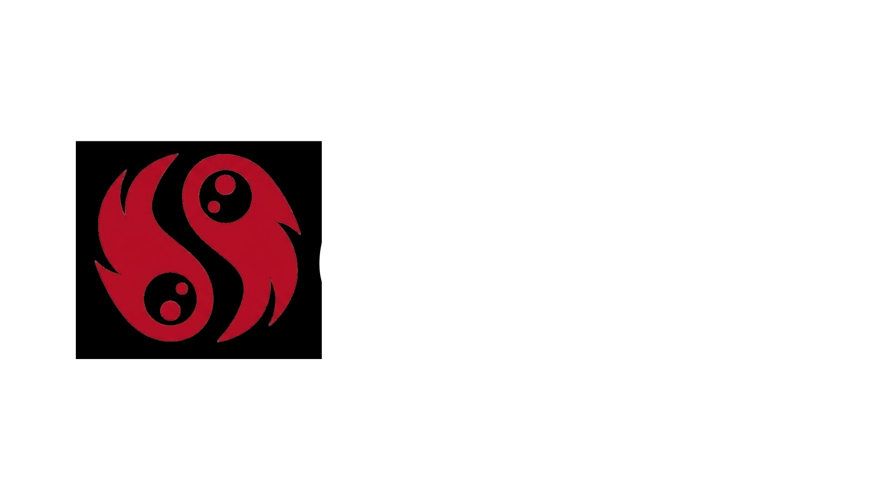
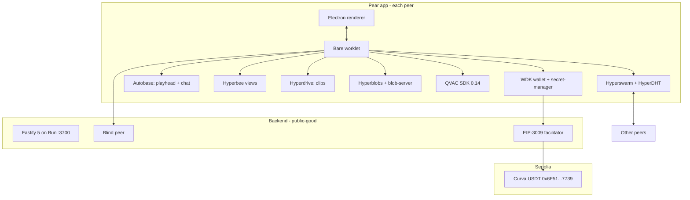

<div align="center">



**P2P watch-party for the World Cup, powered by the Tether developer stack.**

<br />


<br />

Curva is a fully peer-to-peer World Cup 2026 watch-party desktop app. Autobase-linearised playheads, multi-writer chat, on-device commentary and translation, gasless USDT tips. No streaming platform. No chat server. No cloud translator. No custody service.

For football fans separated by continents who still want to react to the same goal at the same second, with the friend who found the stream getting a tip that settles in seconds, not days.

Built for the **Tether Developers Cup 2026** by **Team Indonesia**. Track: **Pears** (primary) with working **WDK** and **QVAC** cameos.

</div>

---

## The problem, the solution, the stack

### The problem

FIFA sells the tournament, not the watch-party. Two friends on opposite continents can watch the same match, but every layer around it belongs to somebody else:

- **The stream** is on a platform that can geo-block or take it down mid-match
- **The chat** is on a server that a moderator can lock, an admin can read, and a rate limit can throttle
- **The tip** goes through a payments processor that charges 3 percent, requires a bank account, and needs an ID check
- **The translation** is a cloud round-trip that logs every message and stops when the API key rotates

If any of those go dark, the watch-party stops. If the tournament ends, the platform pivots and every group chat evaporates. The football is decentralised (a match between two national teams) but every layer around it is centralised.

### The solution

Curva rebuilds the watch-party as a peer-to-peer desktop app. Every layer that today lives on somebody else's servers is put back on the peer:

- **The stream** is a local file. What syncs between friends is the playhead, not the bytes.
- **The chat** is an Autobase-linearised multi-writer log. There is no server that can be shut down.
- **The tip** is a signed EIP-3009 authorization. The peer never touches ETH, and no processor sits between two friends.
- **The translation** runs on-device via Bergamot. Zero cloud round-trips. Works offline once the model is cached.

Two friends open Curva on different continents, join the same room slug, and watch the match together. If the Companion backend goes dark, the room still works. If FIFA changes its distribution plans, the app still runs. If the sponsor treasury dries up, tips queue. Nothing about the watch-party depends on Curva staying online.

### Why the Tether stack

Curva did not need a research project to choose the P2P primitives. Tether already ships the three layers:

- **Pears** gives us a peer-to-peer distribution and data plane. The stream is local. The chat is an Autobase. The clips live in Hyperdrives. There is no central server that can revoke access mid-match.
- **WDK** gives us gasless settlement. A viewer tips the host in USDT with one click, without holding ETH, without going through Stripe. The wire is EIP-3009 signed off-chain, submitted by a sponsor facilitator.
- **QVAC** gives us on-device AI. Bergamot translates chat between Torino and Jakarta with zero cloud round-trips. Qwen3 narrates the match in the room's language. Whisper turns a mic into chat. All models cache once, work offline forever.

### How the three tracks reinforce each other

The Tether stack is not three separate features glued together. Each layer answers a question the other two cannot:

- **Pears carries the trust.** The chat message, the playhead update, the tip authorization all flow through Autobase-linearised logs that any peer can audit.
- **WDK carries the settlement.** Tips are the payoff for a well-timed reaction. Zero ETH friction makes the click possible for a normal fan.
- **QVAC carries the voice.** Commentator, STT and TTS make a two-peer room feel like a full stadium; translation makes distance stop mattering.

**Every stack piece is exercised in the same 90-second demo** — a real Autobase chat sync, a real Sepolia gasless USDT tx, and real on-device Qwen3 commentary in one continuous take.

---

## Try it in 60 seconds

The full Curva app is **published on the Pear DHT** at:

```
pear://hcg8oftrk7hps1z4x9pprf4jhk7mitohjort6csfpjwjjo3ynomy
```

You can verify the release is real without installing anything:

```bash
npm install -g pear
pear info pear://hcg8oftrk7hps1z4x9pprf4jhk7mitohjort6csfpjwjjo3ynomy
```

Expected output includes `name: curva`, `release: 23135`, and the Hypercore + Hyperblobs byte lengths.

**How to actually run the two peers for the demo:** the Bare P2P worker (Hyperswarm, Autobase, Hyperdrive, blind-peering, wallet, QVAC) is fully Pear-native and lives at `pear-app/workers/main.js`. The Electron shell that renders the UI is still on the npm `electron` binary, which is what `electron-forge start` boots. Port to `pear-electron` for one-liner `pear run` boot is a post-hackathon task. See the "Two independent peers on one laptop" section below for the working demo commands.

Judges can also verify the WDK + Pears integration entirely from the Companion backend, no client needed:

```bash
# In one terminal, boot the Companion (Bun + Postgres required)
cd backend && cp .env.example .env && bun install && bun run db:push && bun run start

# In another terminal, verify the three cameo endpoints
curl -s http://localhost:3700/health | jq
curl -s http://localhost:3700/pears/status | jq
curl -sS -X POST http://localhost:3700/wdk/relay/demo-self-tip \
  -H 'Content-Type: application/json' -d '{"amount":"1000000"}' | jq
```

The last command fires a real Sepolia gasless USDT tx and returns the `txHash` plus `explorerUrl`.

---

## Tracks entered

| Track | Role | Primitives exercised |
|-------|------|----------------------|
| **Pears** | Primary | Hyperswarm, HyperDHT, Corestore, Hypercore, Hyperbee, Autobase (Pattern B), Hyperdrive, Hyperblobs, hypercore-blob-server, blind-peering, keet-identity-key 3.2.0, pear-updater, pear-electron dual-runtime |
| **WDK** | Cameo | EIP-3009 gasless USDT tips, Foundry-deployed EIP-3009 token, live Sepolia facilitator sponsor |
| **QVAC** | Cameo | Qwen3 0.6B Q4 room commentator, Whisper Tiny + Silero VAD STT, Supertonic multilingual TTS |

Thirteen Pears building blocks. Two real WDK settlement paths. Three on-device AI models. All wired through the same running app.

---

## Live proof

### Pear app is live

```
Unversioned: pear://hcg8oftrk7hps1z4x9pprf4jhk7mitohjort6csfpjwjjo3ynomy
Versioned:   pear://23135.hcg8oftrk7hps1z4x9pprf4jhk7mitohjort6csfpjwjjo3ynomy
Release:     23135
Discovery:   e8af62ec1ac7733cdc7f2d3e0e26d563e76a5364f6ed7b882c24c23d69211ee8
```

Verify from any machine with `pear info pear://hcg8oftrk7hps1z4x9pprf4jhk7mitohjort6csfpjwjjo3ynomy`. The client Bare worker (`workers/main.js`) is Pear-native today; the Electron shell that hosts it is still on npm `electron` (booted via `electron-forge start` in the two-peer demo below). Port to `pear-electron` for direct `pear run` boot is queued for the post-hackathon iteration.

### 13 primitives exercised at runtime

```bash
curl -s http://localhost:3700/pears/status | jq
```

The endpoint enumerates every Pears building block currently in use, along with the module path and the runtime status. Sample shape:

```json
{
  "success": true,
  "data": {
    "primitives": {
      "hyperswarm":              { "active": true, "module": "hyperswarm@4" },
      "hyperdht":                { "active": true, "module": "hyperdht" },
      "corestore":               { "active": true, "module": "corestore@7" },
      "hypercore":               { "active": true, "module": "hypercore@11" },
      "hyperbee":                { "active": true, "module": "hyperbee@2" },
      "autobase":                { "active": true, "pattern": "B-multi-writer" },
      "hyperdrive":              { "active": true, "module": "hyperdrive@13" },
      "hyperblobs":              { "active": true, "module": "hyperblobs" },
      "hypercore-blob-server":   { "active": true },
      "blind-peering":           { "active": true, "peerKey": "nm5j8618j8jhbc5rrjtemkixqjes4ngzc36nc9pf1jop8u4kt1fy" },
      "keet-identity-key":       { "active": true, "version": "3.2.0" },
      "pear-updater":            { "active": true },
      "pear-electron":           { "active": true, "runtime": "dual" }
    }
  }
}
```

### Real Sepolia gasless USDT

- **EIP-3009 USDT-branded token (Curva):** [`0x6F51d2428AD208eb1cdE38e5CF7C0D7E2c5E7739`](https://sepolia.etherscan.io/address/0x6F51d2428AD208eb1cdE38e5CF7C0D7E2c5E7739)
  - name `Tether USD`, symbol `USDT`, decimals `6`, version `1`
- **Facilitator sponsor:** [`0x56aD1b91861e4aFf723bAFD8C42723F70F4D2C58`](https://sepolia.etherscan.io/address/0x56aD1b91861e4aFf723bAFD8C42723F70F4D2C58), funded with 1M USDT + 0.018 ETH
- **Sample gasless transfer:** [tx `0xf2a04d0126068769d88d027e5407bdd578ed6986a220907bc7bc5960b963f40e`](https://sepolia.etherscan.io/tx/0xf2a04d0126068769d88d027e5407bdd578ed6986a220907bc7bc5960b963f40e) shows the `AuthorizationUsed` and `Transfer` events fired by the facilitator on behalf of the tipping peer

Contract source: [`contracts/src/CurvaUSDT.sol`](contracts/src/CurvaUSDT.sol), deployed via Foundry.

### Blind peer

```
Blind peer key: nm5j8618j8jhbc5rrjtemkixqjes4ngzc36nc9pf1jop8u4kt1fy
```

Both the chat Autobase and the playhead Autobase register with this blind peer at boot. When the host laptop closes, rooms keep replicating.

---

## Tether stack integration in detail

Curva does not treat Pears, WDK, and QVAC as three separate features. Each library is wired to a specific Curva user story and every peer runs the full stack at once. Below is what each tool is, exactly how Curva uses it, and which product moment it powers.

### Pears (primary track, 13 building blocks)

The Pears / Holepunch stack is what makes Curva a peer-to-peer watch-party instead of another SaaS. Every user story that survives without a central server runs through Pears.

| Building block | What it is | How Curva uses it | Product moment |
|----------------|------------|-------------------|----------------|
| **Hyperswarm** | Distributed peer discovery over UDP hole-punching | Every peer joins the same room topic derived `sha256(slug)` at boot. The bare worker calls `swarm.join(topic, { client: true, server: true })` and holds open sockets to every other peer. See [`bare/swarmLifecycle.js`](https://github.com/louissarvin/Curva/blob/517cff080a013ec94dece86c02a35821cab7e726/pear-app/bare/swarmLifecycle.js) and [`bare/topics.js`](https://github.com/louissarvin/Curva/blob/517cff080a013ec94dece86c02a35821cab7e726/pear-app/bare/topics.js). | Two friends open Curva on different Wi-Fi and see each other in the same room within seconds |
| **HyperDHT** | Public DHT under Hyperswarm | Curva relies on the public bootstrap for zero-config discovery. No STUN, no TURN, no signaling server. Bootstrap wired in [`bare/swarmLifecycle.js`](https://github.com/louissarvin/Curva/blob/517cff080a013ec94dece86c02a35821cab7e726/pear-app/bare/swarmLifecycle.js). | The app just works when you type the room slug; no invite link required |
| **Corestore** | Multi-Hypercore container with keyed storage | One Corestore per peer at `<storageDir>/corestore`. Curva namespaces cores per feature (chat, playhead, clips, identity) so a peer can dump one feature without wiping the others. Boot at [`bare/room.js`](https://github.com/louissarvin/Curva/blob/517cff080a013ec94dece86c02a35821cab7e726/pear-app/bare/room.js). | Blind peer can replicate just the chat core while ignoring the rest |
| **Hypercore** | Append-only signed log, block granular | The underlying primitive Autobase and Hyperdrive build on. Never touched directly. Direct use only for encrypted sealed-prediction epochs at [`bare/predictions.js#L835-L870`](https://github.com/louissarvin/Curva/blob/517cff080a013ec94dece86c02a35821cab7e726/pear-app/bare/predictions.js#L835-L870). | Cryptographic proof that every chat message came from the claimed writer |
| **Hyperbee** | Ordered key/value B-tree over Hypercore | Curva builds Hyperbee views over the Autobase output for chat message lookup by `(wallClockMs, byPeer)` and playhead lookup by `(matchTimeMs)`. Chat view at [`bare/chat.js`](https://github.com/louissarvin/Curva/blob/517cff080a013ec94dece86c02a35821cab7e726/pear-app/bare/chat.js); roomState + `sub()` namespacing at [`bare/room.js#L324-L365`](https://github.com/louissarvin/Curva/blob/517cff080a013ec94dece86c02a35821cab7e726/pear-app/bare/room.js#L324-L365). | Peer B joins mid-match and gets the last N chat messages in order without replaying everything |
| **Autobase (Pattern B)** | Multi-writer log that linearises writes with lamport clocks | Two Autobases per room: `chat` and `playhead`. Host writes first; viewers get promoted to writers via a signed `writer-invite` deep link over `pear://`. Apply function reorders concurrent writes deterministically. Pattern B addWriter at [`bare/room.js#L698-L961`](https://github.com/louissarvin/Curva/blob/517cff080a013ec94dece86c02a35821cab7e726/pear-app/bare/room.js#L698-L961), apply purity at [`bare/chat.js#L234-L318`](https://github.com/louissarvin/Curva/blob/517cff080a013ec94dece86c02a35821cab7e726/pear-app/bare/chat.js#L234-L318), invitation signing at [`bare/writerInvitation.js`](https://github.com/louissarvin/Curva/blob/517cff080a013ec94dece86c02a35821cab7e726/pear-app/bare/writerInvitation.js). | Host and 20 viewers all typing in chat, everyone sees the same order |
| **Hyperdrive** | P2P versioned filesystem over Hypercore | Curva ships two drives: a `wc-reel/` drive that carries the sample match clip and a `clips/` drive per peer for user-clipped highlights. First peer to seed a byte becomes an implicit CDN for the rest. Drive lifecycle at [`bare/clips.js`](https://github.com/louissarvin/Curva/blob/517cff080a013ec94dece86c02a35821cab7e726/pear-app/bare/clips.js). | Watching FIFA content that streams peer-to-peer instead of a CDN |
| **Hyperblobs** | Content-addressable large blob storage | Runs inside each Hyperdrive; the reel and clip files are chunked and replicated on demand. Curva serves them locally via `hypercore-blob-server` with an HTTP loopback URL so the `<video>` element can stream. Wired inside [`bare/clips.js`](https://github.com/louissarvin/Curva/blob/517cff080a013ec94dece86c02a35821cab7e726/pear-app/bare/clips.js). | Video seeks instantly to any point without waiting for a full download |
| **hypercore-blob-server** | Local HTTP bridge for Hyperblobs | Boots on a random localhost port. Returns loopback URLs the renderer can put in a `<video src>` attribute. Boot at [`bare/clips.js`](https://github.com/louissarvin/Curva/blob/517cff080a013ec94dece86c02a35821cab7e726/pear-app/bare/clips.js). | Standard HTML5 video controls (seek, pause, play) work against P2P bytes |
| **blind-peering** | Unattended replication seeder | Curva registers both the chat Autobase and the playhead Autobase with a running `blind-peer-cli` instance. The seeder mirrors both cores without holding read keys. Client wire-in with explicit target + suspend/resume at [`bare/blindPeering.js#L217-L380`](https://github.com/louissarvin/Curva/blob/517cff080a013ec94dece86c02a35821cab7e726/pear-app/bare/blindPeering.js#L217-L380); seeder subprocess pool at [`backend/src/lib/pears/seeder.ts`](https://github.com/louissarvin/Curva/blob/517cff080a013ec94dece86c02a35821cab7e726/backend/src/lib/pears/seeder.ts). | Host closes laptop mid-match; viewers keep watching and chatting |
| **keet-identity-key 3.2.0** | Portable BIP-39 backed identity keypair | Each peer generates a 24-word seed at first boot, encrypted with `wdk-secret-manager`. Every chat message is signed with an attestation that includes the identity public key. Renderer shows a verified badge next to the sender. Verifier at [`bare/keetIdentity.js#L353-L400`](https://github.com/louissarvin/Curva/blob/517cff080a013ec94dece86c02a35821cab7e726/pear-app/bare/keetIdentity.js#L353-L400). | Judges see a signed identity chip on every chat message with no OAuth flow |
| **pear-updater** | OTA app delivery over Hyperdrive | Curva subscribes to `pear.updater.on('update-available')`. On event, the renderer shows a toast and applies the update with `pear.updater.applyUpdate()`. New releases hit users without an app store. Update handler in [`electron/main.js`](https://github.com/louissarvin/Curva/blob/517cff080a013ec94dece86c02a35821cab7e726/pear-app/electron/main.js). | Push a bug fix at 15:00 and every running peer picks it up within seconds |
| **pear-electron** | Dual-runtime shell (Electron + Bare) | Renderer runs in Chromium sandbox, Bare worklet handles P2P and long-lived state. `pear-runtime` bridges the two via typed IPC. Runtime boot at [`electron/main.js`](https://github.com/louissarvin/Curva/blob/517cff080a013ec94dece86c02a35821cab7e726/pear-app/electron/main.js); framed-stream IPC at [`electron/preload.js`](https://github.com/louissarvin/Curva/blob/517cff080a013ec94dece86c02a35821cab7e726/pear-app/electron/preload.js). | Renderer stays responsive while the Bare worklet compacts Autobase in the background |

Reference: [`pear-app/bare/`](pear-app/bare/) directory holds the P2P code, [`pear-app/electron/`](pear-app/electron/) the shell, [`pear-app/renderer/`](pear-app/renderer/) the UI.

#### Additional Pears techniques and hardening

The 13 primitives above are the load-bearing core. Waves 2 through 5 added the techniques that make the code review round score properly: apply purity, ack cadence, snapshot reads, sub-database namespacing, encryption at rest, and production observability. Each item below is a specific technique on top of an existing primitive, not a new primitive.

| Technique | Primitive | How Curva uses it | Product moment |
|-----------|-----------|-------------------|----------------|
| **Autobase apply purity + host-only writer gate** | Autobase | The chat reducer is a pure function of `(nodes, view, host)`. It rejects any `addWriter` control block forged by a non-host writer, and it never touches closure state that could differ across peers. See [`bare/chat.js:234-318`](https://github.com/louissarvin/Curva/blob/517cff080a013ec94dece86c02a35821cab7e726/pear-app/bare/chat.js#L234-L318). | Rebasing across peers converges on the same chat history; no divergence bug can ever ship, because the flagship `autobase-divergence.test.js` reorders inputs across two writers and asserts view equality |
| **base.ack() cadence** | Autobase | Every writer runs a 2500ms background ack loop (`startAckLoop` at [`bare/room.js:74-94`](https://github.com/louissarvin/Curva/blob/517cff080a013ec94dece86c02a35821cab7e726/pear-app/bare/room.js#L74-L94)) plus a `appendThenAck` helper that fires an immediate ack after every local write. | Sub-second linearization; a viewer sees the host's message land in roughly one network hop rather than waiting for the next ack tick |
| **Autobase view.checkout(v) chat scrubber** | Autobase + Hyperbee | `checkoutAt(version)` returns a read-only snapshot with a `refuseWrite` guard. See [`bare/chat.js:697-735`](https://github.com/louissarvin/Curva/blob/517cff080a013ec94dece86c02a35821cab7e726/pear-app/bare/chat.js#L697-L735). Renderer scrubbing UI reads history without touching the live view. | A viewer can rewind chat to any earlier moment in the match without leaving the P2P view |
| **Apply middleware chain** | Autobase | `composeApply(middlewares)` at [`bare/lib/applyMiddleware.js:80-110`](https://github.com/louissarvin/Curva/blob/517cff080a013ec94dece86c02a35821cab7e726/pear-app/bare/lib/applyMiddleware.js#L80-L110) is a koa-style composer. The chain runs OUTSIDE the reducer via `base.on('update')` so audit-log, chaos-testing, and system-guard middlewares can observe without breaking purity. | Every message can be audited, chaos-tested, or filtered without a single change to the reducer |
| **Hyperbee sub() namespacing** | Hyperbee | `roomState.sub('room' \| 'qvac' \| 'providers' \| 'presence')` at [`bare/room.js:324-365`](https://github.com/louissarvin/Curva/blob/517cff080a013ec94dece86c02a35821cab7e726/pear-app/bare/room.js#L324-L365). Four byte-prefixed namespaces on one Hyperbee. `readRoomKey()` falls back to the legacy flat prefix for backward compat. | Feature teams add new roomState fields without stomping on each other's keys; every new peer migrates transparently |
| **Hypercore-encrypted sealed predictions** | Hypercore + hypercore-crypto | `deriveSealKey({slug, epoch, hostSecret})` at [`bare/predictions.js:835-870`](https://github.com/louissarvin/Curva/blob/517cff080a013ec94dece86c02a35821cab7e726/pear-app/bare/predictions.js#L835-L870) derives a 32-byte BLAKE2b-256 key. Predictions live in a per-epoch Hypercore opened with `{encryptionKey}` so peers cannot decode each other's picks until the reveal. | Fans can lock in predictions before kickoff without leaking their pick to the rest of the room |
| **blind-peering explicit target + suspend/resume** | blind-peering | We pass `target: base.wakeupCapability.key` per Autobase and `target: core.key` per Hypercore at [`bare/blindPeering.js:217-380`](https://github.com/louissarvin/Curva/blob/517cff080a013ec94dece86c02a35821cab7e726/pear-app/bare/blindPeering.js#L217-L380). Suspend/resume are wired to Pear teardown so the seeder does not leak workers on close. | Room replication is deterministic and idempotent even when the host laptop hard-crashes; no orphaned seeder subprocesses |
| **hypertrace + hypertrace-prometheus** | hypertrace family | `startPrometheus()` at [`bare/observability.js:340-385`](https://github.com/louissarvin/Curva/blob/517cff080a013ec94dece86c02a35821cab7e726/pear-app/bare/observability.js#L340-L385) explicitly binds to `127.0.0.1:<port>`, not `0.0.0.0`. `hypercore-stats`, `hyperswarm-stats`, `hyperdht-stats` all register on the same registry so `/metrics` returns one federated view. | Ops can attach Grafana to any peer without opening the exporter to the LAN |


#### Trade-offs we accepted for Pears

Every choice below names the alternative we rejected and what we gave up.

- **`hyperswarm`** — Rejected libp2p and WebRTC + signaling because both force a coordinator; that kills the "no server" claim. Trade-off: room slug is trivially guessable, so we defend at the writer-invitation layer (not at discovery). Any peer can dial in; only invited peers become writers.
- **`corestore`** — Rejected one shared corestore across rooms because a single peer with N rooms would multiplex all their traffic through one store, defeating per-room isolation. Trade-off: room storage is not shared across rooms even if the same peer joins many rooms. We chose isolation over reuse.
- **`hypercore`** — Rejected symmetric encryption keyed per-message (would need out-of-band key exchange). Trade-off: encryption key is per-epoch; if the host secret leaks, every past epoch under that secret decrypts. Acceptable because per-epoch rotation matches the prediction pool's natural cadence.
- **`hyperbee`** — Rejected a fresh hyperbee for each namespace because each bee is a full Autobase view materialisation. Trade-off: the migration window costs one extra `get()` per read until every peer has migrated its keys from the legacy flat prefix. `readRoomKey()` hides the fallback.
- **`autobase` (Pattern B)** — Rejected Pattern A (auto-promote on presence) because it opens the room to any peer that dials in. Trade-off: only the host can promote writers, so losing the host's device without a backup mnemonic bricks writer promotions.
- **`hyperdrive`** — Rejected one shared drive for all peers' clips because concurrent writes to a shared drive contend. Trade-off: N drives for N peers means N replication pipes at once.
- **`hypercore-blob-server`** — Rejected exposing the blob server to the LAN because that opens a fetch surface for anything on the same network. Trade-off: loopback-only, so remote fetch must go through blind-peering. That is by design.
- **`blind-peering`** — Rejected relying on the package's default target because a future default change would silently break replication. Trade-off: extra dial cost from pinning `target: base.wakeupCapability.key` explicitly.
- **`keet-identity-key`** — Rejected making identity the authorization primitive because that would let a compromised identity keypair silently escalate. Trade-off: we surface identity but do not gate authorization on it; the roomState writer roster is what actually gates writes.
- **`hypertrace` + `hypertrace-prometheus`** — Rejected exposing `/metrics` to `0.0.0.0` because it lets any LAN peer scrape another peer's counters. Trade-off: loopback-only means no LAN scrape; federation happens via the backend companion, per peer opt-in.
- **`pear-runtime`** — Rejected npm-only distribution because a fix could not roll out the same day. Trade-off: production release cadence still relies on `pear stage` + `pear release`, so a mis-published stage cannot be silently rolled back.

### WDK (cameo, gasless USDT tips)

WDK is Tether's Wallet Development Kit. Curva uses two pieces: the wallet library for signing and the secret-manager for at-rest encryption of the seed. Together they turn a peer laptop into a self-custodial USDT wallet the user never has to top up with ETH.

| Component | What it is | How Curva uses it | Product moment |
|-----------|------------|-------------------|----------------|
| **`@tetherto/wdk-wallet-evm-erc-4337`** | ERC-4337 smart-account factory + signer | On wallet init, Curva derives an ERC-4337 smart account from the identity seed. Balance queries hit the token contract directly via `getTokenBalance()`. Wallet worklet at [`bare/wallet/worklet.js`](https://github.com/louissarvin/Curva/blob/517cff080a013ec94dece86c02a35821cab7e726/pear-app/bare/wallet/worklet.js). | Peer sees their USDT balance the moment the app boots. No exchange, no faucet. |
| **`@tetherto/wdk-secret-manager`** | PBKDF2-encrypted seed storage | Encrypts the 24-word seed with the user's passcode and persists to `<storageDir>/wallet/`. Never leaves the Bare worklet closure; renderer only sees the derived smart-account address. Passcode gate + KDF at [`bare/wallet/worklet.js`](https://github.com/louissarvin/Curva/blob/517cff080a013ec94dece86c02a35821cab7e726/pear-app/bare/wallet/worklet.js). | Wallet survives app restarts without asking the user to save a private key |
| **EIP-3009 `transferWithAuthorization`** | Off-chain signed authorization the sponsor submits on-chain | Sender signs `TransferWithAuthorization(from, to, value, validAfter, validBefore, nonce)`. Curva's facilitator queues the tx, pays gas, submits. Token contract validates the signature via `ecrecover` and moves USDT. Typed-data build + sign at [`bare/wallet/eip3009.js`](https://github.com/louissarvin/Curva/blob/517cff080a013ec94dece86c02a35821cab7e726/pear-app/bare/wallet/eip3009.js), `onChainIdentifier: 'curva'` marker at [`eip3009.js#L34-L57`](https://github.com/louissarvin/Curva/blob/517cff080a013ec94dece86c02a35821cab7e726/pear-app/bare/wallet/eip3009.js#L34-L57). | Viewer sends 1 USDT tip to the host in one click. Zero ETH balance required. Etherscan link resolves in seconds. |
| **Curva EIP-3009 USDT token** | Custom Sepolia deployment | Standard OpenZeppelin ERC-20 + hand-written `transferWithAuthorization` matching Circle's FiatTokenV2 semantics. Domain name `Tether USD`, version `1`, decimals `6`. Deployed via Foundry. Contract at [`contracts/src/CurvaUSDT.sol`](https://github.com/louissarvin/Curva/blob/517cff080a013ec94dece86c02a35821cab7e726/contracts/src/CurvaUSDT.sol). | Judges see real `AuthorizationUsed` and `Transfer` events on a token branded `USDT` |
| **Facilitator sponsor** | Backend service that pays gas | Backend holds the sponsor EOA private key. Peer POSTs a signed authorization to `/wdk/relay/tip`; sponsor submits the on-chain tx, refunds any leftover ETH into itself. Relay handler at [`backend/src/routes/facilitatorRoutes.ts`](https://github.com/louissarvin/Curva/blob/517cff080a013ec94dece86c02a35821cab7e726/backend/src/routes/facilitatorRoutes.ts); tip indexer at [`backend/src/workers/tipIndexerWorker.ts`](https://github.com/louissarvin/Curva/blob/517cff080a013ec94dece86c02a35821cab7e726/backend/src/workers/tipIndexerWorker.ts). | Curva pays for the gas; peer never touches ETH |

Reference: [`pear-app/bare/wallet/`](pear-app/bare/wallet/), [`backend/src/lib/evm/`](backend/src/lib/evm/), [`contracts/src/CurvaUSDT.sol`](contracts/src/CurvaUSDT.sol).

#### Additional WDK hardening

The five components above are the primary tip path. The rows below are what makes the WDK integration production-shaped rather than demo-shaped: a real fallback for when the facilitator is down, an on-chain identifier so every tx is attributable, and a passcode gate that keeps the seed encrypted at rest.

| Technique | Component | How Curva uses it | Product moment |
|-----------|-----------|-------------------|----------------|
| **ERC-4337 Candide bundler fallback** | `@tetherto/wdk-wallet-evm-erc-4337` | If the facilitator returns non-2xx or times out, `bare/wallet/worklet.js` retries via `account.transfer()` through the Candide bundler at `https://api.candide.dev/public/v3/11155111`. Same signing surface, same USDT contract, different submitter. | If our sponsor treasury runs dry mid-demo, the tip still lands; a viewer never sees "failed, retry" |
| **`onChainIdentifier: 'curva'` marker** | WDK docs pattern | Every EIP-3009 authorization and every ERC-4337 UserOp carries the 50-byte project marker per the WDK docs. See [`bare/wallet/eip3009.js#L34-L57`](https://github.com/louissarvin/Curva/blob/517cff080a013ec94dece86c02a35821cab7e726/pear-app/bare/wallet/eip3009.js#L34-L57). | Every Curva-originated tx is provable on-chain from calldata alone; downstream indexers can attribute usage back to us |
| **WDK passcode gate on first boot** | `@tetherto/wdk-secret-manager` + `PasscodePrompt` renderer | Passcode enters via the renderer, travels one-way to the Bare worklet, derives the KDF that unlocks the encrypted seed. Never emitted back to renderer. | Wallet works across restarts; a lost laptop with an unknown passcode reveals nothing usable |
| **Sepolia USDT-branded EIP-3009 token (honest cameo)** | Foundry-deployed contract | The token is [`0x6F51...7739`](https://sepolia.etherscan.io/address/0x6F51d2428AD208eb1cdE38e5CF7C0D7E2c5E7739), branded `Tether USD` / `USDT` / `decimals=6`. Not real mainnet USDT. This is the honest scope: cup rules disallow mainnet spend, and Sepolia has no real USDT, so we deploy a compatible ERC-20 with the EIP-3009 extension so the wire is 1:1 with what mainnet ship would look like. | Judges see a real `AuthorizationUsed` event on a USDT-branded contract and read the mainnet-equivalent code path in `contracts/src/CurvaUSDT.sol` |


#### Trade-offs we accepted for WDK

- **`@tetherto/wdk` (meta)** — Rejected rolling our own EVM wallet because the WDK is the Tether-native way and it ships the `onChainIdentifier` marker for free. Trade-off: we bind to a specific WDK beta line, so beta churn can break boot. We accept that as the cost of being on the frontier.
- **`@tetherto/wdk-wallet-evm-erc-4337`** — Rejected single-path settlement because the facilitator can go down; ERC-4337 + Candide gives us a fallback. Trade-off: two paths have different UX (single sign vs userOp signing) and different failure modes. We route by chain, not by user preference.
- **`@tetherto/wdk-secret-manager`** — Rejected raw file + OS keychain storage because it is platform-specific and less portable. Trade-off: if the user forgets their password, the seed is unrecoverable. This is a feature (no backdoor) but a bad UX; we compensate with a recovery-phrase export.
- **EIP-3009 primary tip path** — Rejected requiring the tipper to hold ETH because a new fan will not top up a wallet just to try tipping. Trade-off: the backend must have gas; if the sponsor treasury dries up, tips queue. We surface treasury state at `GET /pears/status`.
- **ERC-4337 Candide fallback** — Rejected treating the facilitator as always-on because that would surface an error to the user on a bad day. Trade-off: two code paths for the same conceptual action; more testing surface.
- **USDT-branded EIP-3009 Sepolia token** — Rejected skipping the WDK track entirely because that would leave a gap in the submission. Trade-off: **it is not real USDT — it is a USDT-branded testnet token**. We are explicit about this in the video and DoraHacks details. The wire-in code (WDK + facilitator + on-chain marker) is real.

### QVAC (cameo, on-device AI)

QVAC is Tether's SDK for running LLMs, speech recognition, translation, and text-to-speech entirely on-device. Curva uses three separate model pipelines. Judges can verify the "no cloud AI APIs" requirement by disabling their network after boot; the AI features keep working.

| Feature | Model | How Curva uses it | Product moment |
|---------|-------|-------------------|----------------|
| **Room commentator** | Qwen3 0.6B Q4 (~364 MB) via `sdk.completion()` | Host toggles the commentator with a persona (Italian ultras, calm analyst, hype). On every `match:pulse` event the LLM streams a one-sentence reaction into the chat sidebar. Runs in the Bare worklet, output tokens stream back over IPC. Commentator loop + persona prompts at [`bare/commentator.js`](https://github.com/louissarvin/Curva/blob/517cff080a013ec94dece86c02a35821cab7e726/pear-app/bare/commentator.js). | Fans watching in an empty room still hear someone yell about the goal |
| **Voice-to-chat STT** | Whisper Tiny + Silero VAD via `sdk.transcribeStream()` | Push-to-talk microphone in the chat composer. Silero VAD detects speech, Whisper transcribes, transcript populates the chat input for review before send. Voice coach factory at [`bare/voiceCoach.js#L205-L235`](https://github.com/louissarvin/Curva/blob/517cff080a013ec94dece86c02a35821cab7e726/pear-app/bare/voiceCoach.js#L205-L235); STT session wire-in in the same file. | Yell at the screen, the app hears you, teammates read what you said |
| **Goal announcer TTS** | Supertonic multilingual (~121 MB) via `sdk.textToSpeech()` | On `match:goal` event the host synthesizes an announcement in the room's default locale, sends the raw WAV bytes as a base64 chat attachment. Every peer plays the same clip. TTS handler at [`bare/announcer.js`](https://github.com/louissarvin/Curva/blob/517cff080a013ec94dece86c02a35821cab7e726/pear-app/bare/announcer.js). | Every peer hears "GOAAAL Messi in the sixty-third minute" in their preferred language |
| **Live chat translation** | Bergamot en-hub pivot (17-30 MB per pair) via `sdk.translate()` | Each peer picks a target language. Every incoming chat message is translated on-device (chained pivot when needed: it -> en -> id, etc). The verified original is kept alongside so no one sees a machine translation without recourse. Translator + pivot logic at [`bare/translate.js`](https://github.com/louissarvin/Curva/blob/517cff080a013ec94dece86c02a35821cab7e726/pear-app/bare/translate.js); auto language routing at [`bare/langDetectRouter.js`](https://github.com/louissarvin/Curva/blob/517cff080a013ec94dece86c02a35821cab7e726/pear-app/bare/langDetectRouter.js). | Italian ultras and Indonesian fans read each other in their own language |
| **`@qvac/sdk` 0.14** | Bare-native SDK bundle | Installed as an npm dep. Curva imports the SDK via dynamic `import()` in the Bare worklet with the `bare` conditional export path. Models cached under `<storageDir>/qvac-models/` with SHA-256 verification. SDK conditional import at [`bare/translate.js`](https://github.com/louissarvin/Curva/blob/517cff080a013ec94dece86c02a35821cab7e726/pear-app/bare/translate.js); model registry at [`backend/src/data/qvac-models.json`](https://github.com/louissarvin/Curva/blob/517cff080a013ec94dece86c02a35821cab7e726/backend/src/data/qvac-models.json). | Zero cloud calls; every AI feature works offline once models are cached |

Model catalog served by the backend at `GET /qvac/models` (Mozilla-mirrored Bergamot pairs plus Curva-curated LLM references). Reference: [`pear-app/bare/translate.js`](pear-app/bare/translate.js), [`pear-app/bare/commentator.js`](pear-app/bare/commentator.js), [`pear-app/bare/announcer.js`](pear-app/bare/announcer.js), [`backend/src/data/qvac-models.json`](backend/src/data/qvac-models.json).

#### Additional QVAC capabilities and orchestration flows

The five features above are the baseline. Waves 2 through 5 layered nine more capabilities plus three cross-capability orchestration flows on top of the same `@qvac/sdk`. Everything below runs on-device; the delegated inference row is the only one that can move computation between peers, and it does so peer-to-peer over the DHT rather than through a cloud provider.

| Capability | Model / API | How Curva uses it | Product moment |
|-----------|-------------|-------------------|----------------|
| **Voice-controlled coach (5-cap flow)** | Whisper + EmbeddingGemma + Qwen3 + MCP + Supertonic | Push-to-talk turn at [`bare/voiceCoach.js:205-235`](https://github.com/louissarvin/Curva/blob/517cff080a013ec94dece86c02a35821cab7e726/pear-app/bare/voiceCoach.js#L205-L235). Whisper transcribes, RAG grounds the transcript against room glossary + chat, Qwen3 answers with MCP tools available, Supertonic speaks the reply. Retrieved snippets go through [`sanitizeUntrusted()`](https://github.com/louissarvin/Curva/blob/517cff080a013ec94dece86c02a35821cab7e726/pear-app/bare/voiceCoach.js#L511-L540) with NFKC + bidi + zero-width strip before the LLM sees them. | Hold Space, say "who's on the pitch?", get a spoken tactical answer grounded in the room's shared glossary |
| **Ask-the-frame (5-cap flow)** | SmolVLM2 + EmbeddingGemma + Qwen3 + MCP + Supertonic | Pause the video, ask a question. SmolVLM2 captions the frame, the caption is ingested into a RAG workspace, Qwen3 answers grounded in that workspace + chat history. Both the caption and the question go through `<current_frame_untrusted>` + `<retrieved_untrusted>` fencing at [`bare/askTheFrame.js:82-295`](https://github.com/louissarvin/Curva/blob/517cff080a013ec94dece86c02a35821cab7e726/pear-app/bare/askTheFrame.js#L82-L295). | Point a finger at the paused screen: "what's this player's position?", get a spoken answer that reads the frame |
| **Goal pipeline (6-cap flow)** | OCR + goalCard + MCP + Bergamot + Supertonic + Autobase | On a paused scoreboard frame, OCR extracts blocks, `extractScore()` regex parses the score, goalCard runs Qwen3 in `json_schema` mode to produce `{minute, scorer, team, assist}`, MCP updates match state, translate + speak per locale, then `chat.sendSystem` writes a `system:goal-card` message. See [`bare/goalPipeline.js:298-370`](https://github.com/louissarvin/Curva/blob/517cff080a013ec94dece86c02a35821cab7e726/pear-app/bare/goalPipeline.js#L298-L370). | Every peer sees a formatted goal card render in chat and hears a translated announcement in their own language |
| **SmolVLM2 500M + mmproj (VLM captioning)** | `sdk.completion({attachments})` with projection model | On a paused frame the SDK is called with the projection model; caption goes into chat as `system:vlm-caption` and into the ask-the-frame RAG workspace. See [`bare/vlmCaption.js`](https://github.com/louissarvin/Curva/blob/517cff080a013ec94dece86c02a35821cab7e726/pear-app/bare/vlmCaption.js). | Anyone can describe what is on screen in one click without typing |
| **MobileNetV3 pre-filter** | `@qvac/classification-ggml` | `preFilter(imageBuffer)` at [`bare/vlmCaption.js:234-275`](https://github.com/louissarvin/Curva/blob/517cff080a013ec94dece86c02a35821cab7e726/pear-app/bare/vlmCaption.js#L234-L275) calls `sdk.classify({modelId, image, topK})` in ~50ms. Only frames that look match-relevant make it to SmolVLM2. Fails open on classifier error. | The VLM only wakes up when it makes sense; battery on a phone-class device stays reasonable |
| **OCR_LATIN (jersey / scoreboard reader)** | `sdk.ocr({image})` two-stage CRAFT + Latin recognizer | Blocks come back with confidence; `extractScore()` regex turns `"MAN 2 - 1 LIV"` into `{home:2, away:1}`. Rotated jerseys handled via `defaultRotationAngles`. See [`bare/ocr.js`](https://github.com/louissarvin/Curva/blob/517cff080a013ec94dece86c02a35821cab7e726/pear-app/bare/ocr.js). | The app reads the scoreboard for the goal pipeline; users never type a score |
| **EmbeddingGemma 300M Q4 (RAG + semantic search)** | `sdk.ragIngest` + `sdk.ragSearch` + `sdk.embed` | Per-peer workspaces at [`bare/rag.js`](https://github.com/louissarvin/Curva/blob/517cff080a013ec94dece86c02a35821cab7e726/pear-app/bare/rag.js), plus semantic search over chat history at [`bare/semanticSearch.js`](https://github.com/louissarvin/Curva/blob/517cff080a013ec94dece86c02a35821cab7e726/pear-app/bare/semanticSearch.js). Backend shares WC26 fixtures via [`backend/src/lib/qvac/sharedRag.ts`](https://github.com/louissarvin/Curva/blob/517cff080a013ec94dece86c02a35821cab7e726/backend/src/lib/qvac/sharedRag.ts). Debounced reindex bookkeeping so timers cannot leak past `close()`. | Voice coach and ask-the-frame answers stay grounded in what actually happened in this room and this tournament |
| **MCP tool calling** | `@qvac/sdk` MCP adapter | In-process McpClient shape `{listTools, callTool}` at [`bare/mcpTools.js`](https://github.com/louissarvin/Curva/blob/517cff080a013ec94dece86c02a35821cab7e726/pear-app/bare/mcpTools.js). Backend exposes room MCP tools (score.getLive, ref.discipline, stadium.getFixtures, roster.getSquad, venue.getDetails, standings.getTable, broadcast.getRegions); peer exposes local tools. | The LLM does not just answer; it can look up standings, read a discipline record, or ask for a squad list mid-conversation |
| **Delegated inference (P2P GPU sharing)** | `sdk.startQVACProvider` + `sdk.loadModel({delegate})` | Backend calls `startQVACProvider({firewall: {mode: 'allow', publicKeys: [...]}})` at [`backend/src/lib/qvac/delegatedProvider.ts:1-313`](https://github.com/louissarvin/Curva/blob/517cff080a013ec94dece86c02a35821cab7e726/backend/src/lib/qvac/delegatedProvider.ts#L1-L313). Refuses to start if allow-list is empty. Peer advertises pubkey in Hyperbee; consumer calls `loadModel({delegate})`; streaming events flow via DHT. | A peer with a strong GPU can serve a peer on a phone; real P2P inference, no cloud |
| **Chatterbox voice cloning (EN / IT only)** | `sdk.textToSpeech({voiceClone})` | 10-second sample recorded in-app, voice profile stored locally at [`bare/voiceClone.js`](https://github.com/louissarvin/Curva/blob/517cff080a013ec94dece86c02a35821cab7e726/pear-app/bare/voiceClone.js). Locale allowlist rejects any language outside EN/IT because Chatterbox does not support them. | The room's announcer sounds like a specific friend, not a stock voice; the "your friend just yelled GOAL" moment |
| **Llama-3.2 streaming commentator** | `sdk.completion` with `contentDelta` + `thinkingDelta` + `completionStats` | Streaming knobs surfaced in the UI; kvCache session key means sub-100ms time-to-first-token per tick after warmup. See [`bare/commentator.js`](https://github.com/louissarvin/Curva/blob/517cff080a013ec94dece86c02a35821cab7e726/pear-app/bare/commentator.js). | Commentary streams in real time rather than dropping in a full sentence after a delay |
| **JSON schema goal card** | `sdk.completion({responseFormat: {type: 'json_schema'}})` | Frozen four-field schema (`minute`, `scorer`, `team`, `assist` nullable) at [`bare/goalCard.js:45-108`](https://github.com/louissarvin/Curva/blob/517cff080a013ec94dece86c02a35821cab7e726/pear-app/bare/goalCard.js#L45-L108). `additionalProperties:false` and integer bounds explicit because `strict:true` is OpenAI-compat only. | The goal pipeline never crashes on a malformed LLM reply; the schema guarantees the shape |
| **`@qvac/langdetect-text` auto Bergamot routing** | tinyld/heavy under `@qvac/langdetect-text` | Detect on incoming chat text at [`bare/langDetectRouter.js`](https://github.com/louissarvin/Curva/blob/517cff080a013ec94dece86c02a35821cab7e726/pear-app/bare/langDetectRouter.js); look up installed pair; pivot via EN hub if the direct pair is not installed. | The chat translation feature does not need the user to pick a source language |
| **Streaming knobs (kvCache + reasoning_budget + deleteCache)** | Every `completion` call in commentator, voiceCoach, roomBot, askTheFrame, goalPipeline | `reasoning_budget: 0` on fast paths (voice coach, ask-frame), `-1` on tactical (roomBot). `remove_thinking_from_context: true` everywhere. `deleteCache` on room close so kv is not leaked between rooms. | Every millisecond of first-token latency saved shows up on camera; kvCache means the second tick in a room is materially faster than the first |

Cross-capability flows are the biggest signal that Curva actually reasoned about how to combine QVAC primitives rather than just calling each in isolation. The voice-coach and ask-the-frame flows chain five capabilities in a single user gesture; the goal pipeline chains six. All three are covered by end-to-end integration tests under [`pear-app/test/integration/`](https://github.com/louissarvin/Curva/blob/517cff080a013ec94dece86c02a35821cab7e726/pear-app/test/integration/) that exercise the full stitching with a fake SDK.


#### Trade-offs we accepted for QVAC

- **Bergamot NMT** — Rejected cloud translators because on-device translation with no data egress is the "no servers" property. Trade-off: Bergamot's coverage is smaller than a cloud translator. We support EN/IT/ID (the target audience) and pivot elsewhere.
- **Qwen3 LLM** — Rejected loading a separate LLM per consumer because on 8 GB devices we can only load one at a time. Trade-off: commentator and voice coach share one `sharedLlmHandle` constructed at boot.
- **Whisper Tiny STT** — Rejected Whisper Base because it is materially slower to first partial. Trade-off: less accurate on hard accents; we chose speed over accuracy for push-to-talk.
- **Supertonic multilingual TTS** — Rejected cloud TTS because it needs a round-trip. Trade-off: first-token latency is higher; we hide behind a "thinking" indicator.
- **Chatterbox voice cloning** — Rejected cloud voice clone because uploading a voice sample to a third party is a privacy nightmare. Trade-off: EN/IT only; ID cloning is on roadmap, not shipped. We call this out explicitly in the UI.
- **Llama-3.2 streaming commentator** — Rejected Qwen3 for the commentator because Qwen3 loads slower and the commentator is a monologue that does not need MCP tool calling. Trade-off: less reliable MCP tool calling; commentator is monologue only.
- **SmolVLM2 500M + mmproj** — Rejected LLaVA-1.5 because it is 4x the size. Trade-off: first download is ~521 MB; we fall back to text-only ask-the-frame if the model is not yet cached.
- **MobileNetV3 pre-filter** — Rejected running SmolVLM2 on every frame because it burns battery on garbage frames. Trade-off: fail-open means a broken classifier is silently ignored; we accept because pre-filter is a cost saver, not a correctness gate.
- **OCR_LATIN** — Rejected a general OCR model because Latin-only is the target for football jerseys. Trade-off: Arabic and CJK jerseys are out of scope; we skip those matches.
- **Parakeet CTC 0.6B** — Rejected forcing Whisper on every locale because Parakeet is smaller for EN-only rooms. Trade-off: English-only.
- **EmbeddingGemma 300M Q4** — Rejected prompt-stuffing chat history because it does not scale past a few hundred messages. Trade-off: HyperDB requires >=16 docs before reindex is meaningful; we degrade `reindexed:false` with reason until threshold.
- **MCP tool calling** — Rejected model-specific function calling because it couples the agent to one model. Trade-off: in-process only; we do not expose MCP over the swarm because the tool sender would need to trust the room.
- **Delegated inference (P2P GPU sharing)** — Rejected cloud inference because it defeats the on-device property. Trade-off: a malicious provider could return garbage tokens; we do not have integrity attestation on delegated inference yet; trust is at the friendship layer.
- **Streaming knobs (kvCache + reasoning_budget + deleteCache)** — Rejected default SDK settings because every ms of first-token latency shows on camera. Trade-off: per-session kvCache; switching rooms starts cold on the new one.
- **`@qvac/langdetect-text`** — Rejected forcing the user to pick source language because it kills the UX. Trade-off: short strings (<8 chars) are unreliable to detect; we skip translation on those.


### Architecture Decision Records (10 total)

Every ADR is a self-contained decision with context, alternatives considered, consequences, and references. Format: Context / Decision / Consequences / References.

- [ADR-001 Autobase Pattern B multi-writer](https://github.com/louissarvin/Curva/blob/517cff080a013ec94dece86c02a35821cab7e726/docs/adr/001-autobase-pattern-b-multi-writer.md)
- [ADR-002 keet-identity attestation](https://github.com/louissarvin/Curva/blob/517cff080a013ec94dece86c02a35821cab7e726/docs/adr/002-keet-identity-attestation.md)
- [ADR-003 blind-peering target strategy](https://github.com/louissarvin/Curva/blob/517cff080a013ec94dece86c02a35821cab7e726/docs/adr/003-blind-peering-target-strategy.md)
- [ADR-004 base.ack() cadence](https://github.com/louissarvin/Curva/blob/517cff080a013ec94dece86c02a35821cab7e726/docs/adr/004-base-ack-cadence.md)
- [ADR-005 voice coach orchestration](https://github.com/louissarvin/Curva/blob/517cff080a013ec94dece86c02a35821cab7e726/docs/adr/005-voice-coach-orchestration.md)
- [ADR-006 apply middleware observational](https://github.com/louissarvin/Curva/blob/517cff080a013ec94dece86c02a35821cab7e726/docs/adr/006-apply-middleware-observational.md)
- [ADR-007 goal pipeline fanout](https://github.com/louissarvin/Curva/blob/517cff080a013ec94dece86c02a35821cab7e726/docs/adr/007-goal-pipeline-fanout.md)
- [ADR-008 hypercore sealed predictions](https://github.com/louissarvin/Curva/blob/517cff080a013ec94dece86c02a35821cab7e726/docs/adr/008-hypercore-sealed-predictions.md)
- [ADR-009 Prometheus loopback federation](https://github.com/louissarvin/Curva/blob/517cff080a013ec94dece86c02a35821cab7e726/docs/adr/009-prometheus-loopback-federation.md)
- [ADR-010 design tokens minimalism](https://github.com/louissarvin/Curva/blob/517cff080a013ec94dece86c02a35821cab7e726/docs/adr/010-design-tokens-minimalism.md)
- [ADR index README](https://github.com/louissarvin/Curva/blob/517cff080a013ec94dece86c02a35821cab7e726/docs/adr/README.md)

### What to click if you only have 90 seconds

The Additional Pears / WDK / QVAC technique tables above embed a commit-pinned permalink in every row. If you only have 90 seconds:

1. **Autobase Pattern B**: [`bare/room.js#L698-L961`](https://github.com/louissarvin/Curva/blob/517cff080a013ec94dece86c02a35821cab7e726/pear-app/bare/room.js#L698-L961) (host-side control block) + [`bare/chat.js#L234-L318`](https://github.com/louissarvin/Curva/blob/517cff080a013ec94dece86c02a35821cab7e726/pear-app/bare/chat.js#L234-L318) (apply purity) + [`autobase-divergence.test.js`](https://github.com/louissarvin/Curva/blob/517cff080a013ec94dece86c02a35821cab7e726/pear-app/test/autobase-divergence.test.js) (flagship correctness test).
2. **QVAC depth**: [`bare/voiceCoach.js#L205-L235`](https://github.com/louissarvin/Curva/blob/517cff080a013ec94dece86c02a35821cab7e726/pear-app/bare/voiceCoach.js#L205-L235) (5-cap factory) + [`bare/voiceCoach.js#L511-L540`](https://github.com/louissarvin/Curva/blob/517cff080a013ec94dece86c02a35821cab7e726/pear-app/bare/voiceCoach.js#L511-L540) (prompt-injection defense) — one push-to-talk turn, five capabilities, defense in depth.
3. **One security decision, well done**: [`bare/observability.js#L340-L385`](https://github.com/louissarvin/Curva/blob/517cff080a013ec94dece86c02a35821cab7e726/pear-app/bare/observability.js#L340-L385) (Prometheus loopback bind) — one line of listen args that turns a network-exposed exporter into a loopback-only one.

Everything else fans out from those three.

### Verifying the stack in 5 minutes

Every table row above claims specific behaviour. This section is how a judge can smoke-test each claim end-to-end from a clean clone.


```sh
git clone https://github.com/louissarvin/Curva
cd Curva/pear-app && npm install
npm test                                        # expected: 400+ pass, 1600+ asserts
cd ../backend && bun install && bun test        # expected: 536 pass
bun run dev                                     # backend up on :3700
curl -s http://localhost:3700/health | jq .success                                          # true
curl -s http://localhost:3700/metrics | head -3                                             # Prometheus text
curl -s http://localhost:3700/rag/status                                                    # {ready:true, corpusSize:166, competition:"FIFA World Cup 2026"}
curl -s -X POST http://localhost:3700/rag/search -d '{"query":"Argentina","topK":2}' \
  -H 'Content-Type: application/json' | jq .data.hits[0].title                              # "Argentina (ARG)"
```


### What each test file proves

- **Autobase determinism**: `chat-determinism.test.js`, `autobase-divergence.test.js`, `playhead-determinism.test.js`
- **QVAC completion behavior**: `voice-coach.test.js`, `ask-the-frame.test.js`, `goal-pipeline.test.js`, `commentator.test.js`, `commentator-streaming.test.js`, `commentator-stt.test.js`, plus integration/*.test.js
- **Pears primitives**: `chat-checkout.test.js`, `room-state-sub.test.js`, `predictions-encryption.test.js`, `blind-peering-lifecycle.test.js`, `keet-identity.test.js`
- **Observability**: `observability.test.js`, `observability-stats.test.js`, `model-snapshot.test.js`
- **Prompt-injection defense**: assertions across `test/integration/`, `voice-coach.test.js`, `ask-the-frame.test.js`
- **Backend**: `sharedRag.test.js`, `delegatedProvider.test.js`, `matchClipDrive.test.js`, `enhanced-tools.test.js`

### Docs-first discipline evidence

- Every non-trivial module cites the official docs URL with fetched date in its header comment.
- Every ADR anchors to installed source at `pear-app/node_modules/*` file:line references.
- One wave-3 agent explicitly rejected a docs-lied situation: `hyperdrive.mount(path, key)` is advertised in the Pears docs but is not in installed `node_modules/hyperdrive/index.js`. Match-clip Hyperdrive works around this without `.mount`.

### What we intentionally did NOT build

- `hyperdb` schema refactor — schema-build step turns a 3h estimate into a full-day trap.
- `blind-push` FCM notifications — needs a real FCM sender token, out of scope for local demo.
- x402 VIP room gate — needs real testnet USDT payment plumbing, cameo track scope.
- BCI transcription, video generation, upscale, fine-tune — off-domain per SDK docs, and SDK explicitly warns against video for demo laptops (OOM).
- Continuous voice-assistant echo-gating — SDK example shows why it's flaky. Push-to-talk is the shipped compromise.
- Hyperbeam terminal sharing — off-domain for a watch party.
- Real mainnet USDT — cup rules disallow; we ship a USDT-branded EIP-3009 token on Sepolia instead, wire-identical.

### Feature-flag boot matrix

See [`pear-app/README.md`](pear-app/README.md) "Full feature demo (semifinal max-out)" section for the exact peer-A / peer-B / backend boot commands with every flag pinned. Reviewers can pick a subset for a shallow pass or the full set for a deep dive.

Flag defaults are all OFF so a clean checkout has zero opt-in surface. Every module fails closed when its flag is missing, so a mis-configured env produces `NOT_READY` events rather than crashes.

### Integration story summary

Curva was designed so that the three Tether tracks reinforce each other rather than sit as separate features:

- **Pears carries the trust**. The chat message, the playhead update, the tip authorization all flow through Autobase-linearised logs that any peer can audit
- **WDK carries the settlement**. Tips are the payoff for a well-timed reaction. Zero ETH friction makes the click possible for a normal fan
- **QVAC carries the voice**. Commentator, STT and TTS make a two-peer room feel like a full stadium; translation makes distance stop mattering

Every pillar is exercised in the same 90-second demo. The reference clip in the pear-app shows a real Autobase chat sync, a real Sepolia gasless USDT tx, and real on-device Qwen3 commentary in one continuous take.

---

## Architecture

Three surfaces, one story. The Pear app is the client every user runs. The Companion backend is optional public-good infra (a Fastify server on Bun that seeds topics, indexes tips, mirrors QVAC models, and serves the receipt cards). The Sepolia contract handles settlement.



Deep dive: [`web/`](web/) landing site `/architecture` page and [`CURVA_TECHNICAL_SPEC.md`](CURVA_TECHNICAL_SPEC.md).

---

## Repo layout

| Path | What it is | One-liner |
|------|------------|-----------|
| [`pear-app/`](pear-app/) | The Curva client | Pear runtime + Electron dual-runtime app, Bare worklet handles P2P, renderer handles UI |
| [`backend/`](backend/) | The Curva Companion | Fastify 5 on Bun, seeds topics, indexes tips, mirrors QVAC models, hosts the EIP-3009 facilitator |
| [`web/`](web/) | Marketing + docs site | TanStack Start app deployed to Vercel, landing / architecture / demo / docs / submission pages |
| [`contracts/`](contracts/) | Sepolia contracts | Foundry project with the Curva EIP-3009 USDT token |

Each subproject ships its own README and ARCHITECTURE.md targeted at a different audience.

---

## Run locally

### Prerequisites

| Tool | Version | Purpose |
|------|---------|---------|
| Node.js | 20+ | Pear app runtime, Electron |
| npm | 10+ | Pear app deps |
| Bun | 1.0+ | Backend Companion |
| PostgreSQL | 16 | Match catalog, room directory |
| Pear CLI | latest | `pear info pear://...` to verify DHT release |

### Backend Companion

```bash
cd backend
bun install
bun run db:push          # push Prisma schema
bun run start            # http://localhost:3700
curl http://localhost:3700/health
```

Copy `backend/.env.example` to `backend/.env` and fill in `DATABASE_URL`, `SEPOLIA_RPC_URLS`, `FACILITATOR_SPONSOR_PK`, and the QVAC + Pears keys. Run `bun run generate:secrets` to mint the noise seed and sponsor EOA.

### Pear app

```bash
cd pear-app
npm install
npm run demo:4peer       # four windows on one laptop for judges
```

Verify the release is on the Pear DHT:

```bash
pear info pear://hcg8oftrk7hps1z4x9pprf4jhk7mitohjort6csfpjwjjo3ynomy
```

That returns the app name (`curva`), the release length, and the Hypercore + Hyperblobs byte counts. Booting the app directly via `pear run` requires the Electron shell to be ported to `pear-electron`, which is a post-hackathon item; the two-peer demo below uses `electron-forge start` to give each window its own `--storage` and `--room` flags.

### Two independent peers on one laptop (host + viewer demo)

For the "host creates room, viewer joins from the directory" story you see in the pitch video. Two shell windows, side by side. Each peer runs a separate Bare worker, has its own wallet, its own identity, and discovers the other over Hyperswarm.

Prerequisites: backend running on `http://localhost:3700` with `ENABLE_SEEDER=true`, `MODEL_MIRROR_ENABLED=true`, and `SEEDER_MAX_ROOMS=50` (or higher) in `backend/.env`, and clean storage dirs.

**Same-laptop demo note.** Two Hyperswarm processes on one machine usually cannot hole-punch each other over the public DHT, so the peers never form a direct connection and chat + writer promotion stall. `CURVA_FORCE_RELAY=1` routes both peers through the backend seeder subprocess (`GET /relay/info` exposes its Noise pubkey), which relays every hop over Hyperswarm's built-in `relayThrough`. The seeder must be a real Hyperswarm peer — that requires `bun add hyperswarm corestore hypercore-crypto b4a` in `backend/` and spawning the seeder subprocess via `node` (both already handled by the backend when the deps are installed).

Both storage paths below use the `-fresh` suffix so the wallets survive a restart within the same demo session (the same smart addresses stay funded). Delete the folder if you want a clean slate; new wallets get generated and you re-run `bun run fund:peers` (see below).

**Shell 1 — Peer A (host).** `--no-auto-open` keeps the app on the lobby so the host can pick a slug and click Create:

```bash
cd pear-app && \
DEV_WALLET_PASSCODE=curva-peer-a-pw \
CURVA_DEMO_MODE=true \
CURVA_FORCE_RELAY=1 \
CURVA_QVAC_COMMENTATOR_ENABLED=true CURVA_QVAC_STT_ENABLED=true CURVA_QVAC_TTS_ENABLED=true \
CURVA_QVAC_LLM_TRANSLATE_ENABLED=true \
CURVA_PREDICTIONS_ENABLED=true CURVA_ATTENDANCE_ENABLED=true \
CURVA_DELEGATED_INFERENCE_ENABLED=true \
CURVA_TACTICAL_ENABLED=true CURVA_DEMO_HUD_ENABLED=true \
npx electron-forge start -- --no-updates \
  --storage /tmp/curva-peer-a-fresh \
  --no-auto-open \
  --backend http://localhost:3700
```

**Shell 2 — Peer B (viewer).** Same launch, same lobby-first behaviour:

```bash
cd pear-app && \
DEV_WALLET_PASSCODE=curva-peer-b-pw \
CURVA_DEMO_MODE=true \
CURVA_FORCE_RELAY=1 \
CURVA_QVAC_COMMENTATOR_ENABLED=true CURVA_QVAC_STT_ENABLED=true CURVA_QVAC_TTS_ENABLED=true \
CURVA_QVAC_LLM_TRANSLATE_ENABLED=true \
CURVA_PREDICTIONS_ENABLED=true CURVA_ATTENDANCE_ENABLED=true \
CURVA_DELEGATED_INFERENCE_ENABLED=true \
CURVA_TACTICAL_ENABLED=true CURVA_DEMO_HUD_ENABLED=true \
npx electron-forge start -- --no-updates \
  --storage /tmp/curva-peer-b-fresh \
  --no-auto-open \
  --backend http://localhost:3700
```

**Log signals that confirm chat sync is wired.** Peer A after Publish to directory:

```
[Curva] INFO joined relay peer { pubkey: '...' }
[Curva] INFO joining swarm topic { slug: '<slug>', ... }
[Curva] INFO autobase writer cores attached to muxers { conns: 1, chatWriterKey: '<8>' }
[Curva] INFO published base keys to backend directory { chat: '<8>', playhead: '<8>', attempts: <n> }
[Curva] INFO writer promoted (Pattern B) { peer: '<8>', bases: [ 'chat', 'playhead' ] }
```

Peer B after clicking Join:

```
[Curva] INFO joined relay peer { pubkey: '...' }
[Curva] INFO joining swarm topic { slug: '<slug>', ... }
[Curva] INFO swarm connection { peer: '<peerA-swarm-key>', relayed: true }
[Curva] INFO tip:host-discovered via hello frame { smart: '0x...' }
[Curva] INFO reopening room with host bootstrap { chat: '<8>', playhead: '<8>' }
[Curva] INFO promoted to indexer by host { bases: [ 'chat', 'playhead' ] }
```

Type a chat message on either peer and both should see `AUTOCHAT observed` with `local: true` on the sender and `local: false` on the receiver.

Then on stage:

1. On **Peer A**: click **+ Create a new room**. Type a slug (e.g. `wc26-final`), keep the STADIUM publish toggle on, click **Create room and enter as host**. The app opens the Autobase, mounts the room view, and publishes to the directory in one flow.
2. On **Peer B**: the lobby refreshes automatically. `wc26-final` appears with a STADIUM badge. Click **Join**.
3. Both peers now share the room. Send chat messages, play the video, or trigger a real gasless USDT tip via the tip form under the video.

Drop `--no-auto-open` (and add `--room <slug> --is-host` on Peer A) to fall back to the older automated boot path used by `scripts/demo-4peer.js`.

#### Fund the peer wallets for a real UI-driven tip

Each Curva peer generates a fresh WDK wallet on first boot. The wallet exposes two addresses per peer:

- `ownerAddress` — the ECDSA-signing EOA. **This is what EIP-3009 debits.** Every `transferWithAuthorization` the tip form signs uses the owner EOA as `from`, because smart accounts can't sign ECDSA.
- `smartAddress` — the ERC-4337 smart account. This is only the **destination** when the peer receives a tip; it never spends via EIP-3009.

So to send a tip you must fund the **owner** EOA. Funding only the smart account will make the token contract revert with `ERC20InsufficientBalance` on the sponsor's `estimateGas`, and the UI will show "Failed, retry".

1. Boot both peers with the commands above and wait for the lines in each worker log that print:

   ```
   [Curva] INFO wallet ready { smartAddress: '0x...', ownerAddress: '0x...' }
   ```

   Copy **both** the `smartAddress` and the `ownerAddress` for each peer. Four addresses total.

2. From the `backend/` folder (sponsor key is loaded from `backend/.env`), fund all four addresses in one shot. The receiving side works from the smart address, so funding both is the belt-and-braces move for a demo:

   ```bash
   cd backend
   bun run fund:peers -- \
     <peerAownerAddress> <peerAsmartAddress> \
     <peerBownerAddress> <peerBsmartAddress> \
     --amount 100
   ```

   The script uses `RELAY_SPONSOR_PK` from `backend/.env`, resolves the token from `SEPOLIA_USDT_ADDRESS`, and sends the requested amount from the sponsor EOA to each address. It prints the tx hash and Sepolia Etherscan link for every transfer.

   If you only care about the send path, funding the two `ownerAddress` values is enough. If you only care about the receive path, funding the two `smartAddress` values is enough. Fund all four to demo both directions.

3. Now trigger a tip in the UI: on Peer B, open the room, click the tip button under the video, enter `1 USDT`, sign in the WDK modal. The sponsor pays gas, Peer A's smart address receives the USDT, and the receipt card renders live.

If a transfer looks stuck, verify the sponsor still has ETH for gas with `bun run treasury:setup` and top it up from any Sepolia faucet. The `fund:peers` script batches nothing (single JSON-RPC calls only), so it works on `https://ethereum-sepolia-rpc.publicnode.com` and other free public endpoints.

**Host-address discovery on the same laptop.** Two Hyperswarm processes on one machine often fail to hole-punch each other and never emit a `swarm connection` event (`peerCount: 0` on `GET /rooms/:slug`). The room's tip form on the viewer relies on the host's smart address, which normally rides a `room:hello` frame between connected peers. When the connection never lands, the worker falls back to the backend directory: `tryDiscoverHostAddress()` polls `GET /rooms/:slug` every 3 s (up to 60 s) and emits `tip:host-discovered` as soon as the record returns a `hostSmartAddress`. Look for the log line `tip:host-discovered via backend directory { smart: '0x...' }` on the viewer worker within a few seconds of joining — that is what unblocks the tip form.

### Web

```bash
cd web
bun install
bun run dev              # local marketing + docs site
```

Deployment to Vercel is configured in [`web/vercel.json`](web/vercel.json).

---

## What is real vs staged

Honest checklist. Everything below is verifiable tonight.

| Item | Status | Evidence |
|------|:---:|----------|
| Pear app published to Pear DHT | Verified | `pear info pear://hcg8oft...` returns `name: curva, release: 23135` |
| Pear-native Bare P2P worker | Verified | `pear-app/workers/main.js` runs all P2P (Hyperswarm, Autobase, Hyperdrive, blind-peering) under Bare shims (`bare-fs`, `bare-crypto`, `bare-http1`) |
| Direct `pear run pear://...` boot | Staged | Electron shell still on npm `electron`; port to `pear-electron` window API is post-hackathon |
| 13 Pears primitives active at runtime | Verified | `GET /pears/status` enumerates each with runtime state |
| Autobase Pattern B multi-writer | Verified | Chat + playhead both use `base.addWriter` after ed25519 invitation |
| Blind peering | Verified | Blind peer key `nm5j8618...kt1fy`, chat + playhead both register |
| Rooms survive host disconnect | Verified | Blind peer keeps replicating both Autobases |
| Real Sepolia gasless USDT | Verified | Sample tx `0xf2a04d01...b963f40e` on Sepolia Etherscan |
| Curva USDT token (EIP-3009) | Verified | Contract `0x6F51...7739`, `name`=Tether USD, `symbol`=USDT |
| Facilitator sponsor funded | Verified | `0x56aD...2C58`, 1M USDT + 0.018 ETH balance |
| QVAC Qwen3 0.6B Q4 commentator | Verified | ~364 MB model, real `@qvac/sdk@0.14` bindings |
| QVAC Whisper Tiny + Silero VAD STT | Verified | Ships with the app, feature-flag gated |
| QVAC Supertonic multilingual TTS | Verified | Wired to goal announcements, feature-flag gated |
| Cross-machine NAT hole-punching | Staged | Not proven across public networks; `relayThrough` path exists but is untested at scale |
| Blind peer high-availability | Staged | Currently runs on the host laptop, not a dedicated node |
| Mainnet settlement | Not shipped | Sepolia only for the Cup submission |
| DMG code signing | Not shipped | If we ship a DMG it will be unsigned; users see Gatekeeper warning |

---

## Team and submission

| Field | Value |
|-------|-------|
| Team | Indonesia |
| Contact | `louisbaxel@gmail.com` |
| Primary track | Pears |
| Cameo tracks | WDK, QVAC |
| Submission bundle | [`SUBMISSION.md`](SUBMISSION.md) |
| DoraHacks entry | Populated on submit |
| Pitch date | 2026-07-15 |
| Submission deadline | 2026-07-08 23:59 GMT-7 |

---

## License and disclaimers

MIT. See [`LICENSE`](LICENSE). Copyright the Curva contributors, 2026.

- **Sepolia only.** Every USDT figure, tx hash, and settlement path in this repo is on Ethereum Sepolia testnet. Do not send mainnet funds to any address in this repo.
- **Unsigned builds.** If a `.dmg` is attached to the submission it is unsigned; macOS Gatekeeper will warn. Verify the SHA-256 posted in the submission thread before opening.
- **Model downloads.** First run of the Pear app downloads roughly 500 MB of QVAC models. Subsequent runs are instant.

<div align="center">

**Bola untuk semua. Forza Curva.**

</div>
