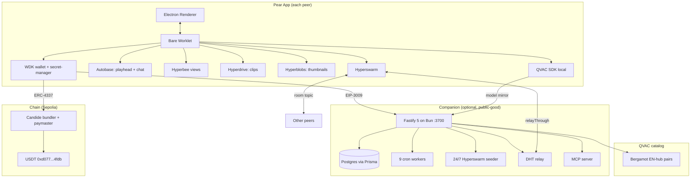
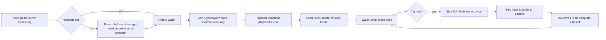
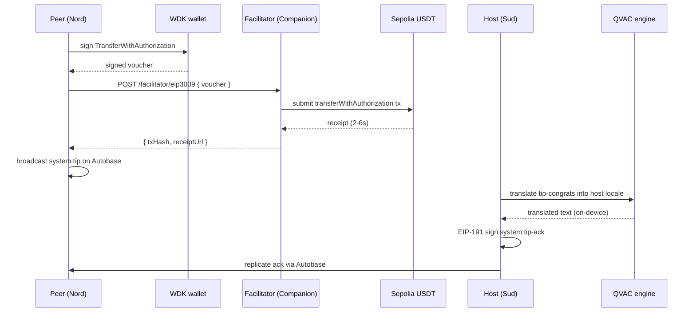

<div align="center">

# Curva

**Watch the World Cup with friends, peer-to-peer.**

A fully P2P World Cup 2026 watch-party desktop app. Synced playheads, multi-writer chat, on-device translation, gasless USDT tips. No streaming platform. No chat server. No cloud translator. No custody service.

[Quick Start](#quick-start) - [Architecture](#architecture) - [How It Works](#how-it-works) - [API](#api-endpoints) - [Demo](#live-demo)


</div>

---

## The Problem

The World Cup is the biggest shared event on Earth, and watching it with a friend on another continent is still broken. FIFA broadcast rights are geo-fenced. Watch-party apps route every message and every video frame through a corporate relay. Translation tools ship your chat to someone else's GPU. Tipping the friend who found the stream needs a custodial account, a card processor, and a gas token you do not own.

Curva strips the middlemen out. Two peers open a `pear://curva?room=<slug>` deep link. Video playheads sync through Autobase. Chat runs on a multi-writer Autobase with a Hyperbee view. Goal clips replicate through per-peer Hyperdrives. Tips settle in gasless USDT via WDK. Chat is translated on-device via QVAC Bergamot. Nothing touches a server that Curva controls. The optional Companion backend is public-good infrastructure, positioned the way Tether positions Keet's public seeders, and the app functions when it is unreachable.

---

## Capabilities

<table>
<tr>
<td width="25%" valign="top">

**01. Synced playback**

Autobase-linearised playhead. Sub-second sync across continents. Every peer is a writer.

</td>
<td width="25%" valign="top">

**02. Multi-writer chat**

Autobase Pattern B. Host signs an ed25519 invitation, `base.addWriter` promotes peers. New writers keep chatting after the host disconnects.

</td>
<td width="25%" valign="top">

**03. On-device translation**

QVAC Bergamot with native `modelConfig.pivotModel`. 12 EN-hub language pairs. IT to ID pivots through English. Zero network calls.

</td>
<td width="25%" valign="top">

**04. Gasless USDT tips**

WDK dual-path. EIP-3009 facilitator primary at 2 to 6 seconds. ERC-4337 UserOp fallback via Candide bundler with `onChainIdentifier: 'curva'`.

</td>
</tr>
<tr>
<td valign="top">

**05. Goal clip sharing**

Per-peer Hyperdrives with `findingPeers` cold-start. 128x72 Hyperblobs thumbnails via ffmpeg baseline.

</td>
<td valign="top">

**06. Cross-pillar beat**

`system:tip` then `system:tip-congrats` (QVAC-translated per receiver locale) then `system:tip-ack` (host EIP-191 signed). All three pillars in 15 seconds.

</td>
<td valign="top">

**07. NAT-hostile fallback**

`relayThrough` served from `GET /relay/info`. Symmetric-NAT peers keep replicating without hole-punching.

</td>
<td valign="top">

**08. Reproducible demo**

`npm run demo:4peer` spawns four peers on a single laptop. `pear run pear://curva?room=<slug>` for the published alias path.

</td>
</tr>
</table>

---

## Architecture

### System Overview



### User Flow



### Tip Data Flow



---

## How It Works

### Pears P2P sync

Nine Pears building blocks. File evidence for every one. Full index in `CURVA_TECHNICAL_SPEC.md` Section 7.

| Building block | Where it lives | Purpose |
|----------------|----------------|---------|
| Hyperswarm | `pear-app/bare/swarmLifecycle.js` | Room discovery on sha256 topic, `relayThrough` NAT fallback |
| Corestore | `pear-app/bare/room.js` | One disk root, many named cores per room |
| Hypercore | `pear-app/bare/playhead.js`, `chat.js`, `clips.js` | Named cores for playhead, chat, clips, room state |
| Autobase | `pear-app/bare/playhead.js`, `chat.js`, `writerInvitation.js` | Multi-writer playhead and chat, Pattern B addWriter |
| Hyperbee | `pear-app/bare/chat.js`, `room.js`, `tip.js` | Chat view, room state, tip log, writer roster, reactions |
| Hyperdrive | `pear-app/bare/clips.js` | Per-peer clip filesystem with `findingPeers` cold-start |
| Hyperblobs | `pear-app/bare/clips.js` | 128x72 ffmpeg-baseline clip thumbnails |
| hypercore-crypto | `pear-app/bare/topics.js`, `writerInvitation.js` | Topic derivation and ed25519 writer invitations |
| pear-runtime-updater | `pear-app/electron/main.js` | OTA renderer toast; backend runs in-process seeder daemon on drive discovery keys |

### WDK dual-path tipping

| Item | Value |
|------|-------|
| Packages | `@tetherto/wdk` ^1.0.0-beta.12, `@tetherto/wdk-wallet-evm-erc-4337` ^1.0.0-beta.10, `@tetherto/wdk-secret-manager` ^1.0.0-beta.3 |
| Chain | Sepolia, chainId `11155111` |
| USDT | `0xd077a400968890eacc75cdc901f0356c943e4fdb` |
| Path A (primary) | EIP-3009 `TransferWithAuthorization`, facilitator submits, 2 to 6 seconds to receipt |
| Path B (fallback) | ERC-4337 UserOp via Candide bundler + paymaster at `https://api.candide.dev/public/v3/11155111`, `onChainIdentifier: 'curva'` appended (50-byte marker) |
| Secret storage | `@tetherto/wdk-secret-manager` (PBKDF2 + XSalsa20-Poly1305), gated by `PasscodePrompt.js` |
| Proof surface | `GET /wdk/verify/:txHash` returns Etherscan proof URL, JSON or HTML receipt |

Path A code: `pear-app/bare/wallet/eip3009.js`, `backend/src/routes/facilitatorRoutes.ts`.
Path B code: `pear-app/bare/wallet/worklet.js:125`.

### QVAC on-device translation

| Item | Value |
|------|-------|
| Packages | `@qvac/sdk` ^0.14.0 + `@qvac/translation-nmtcpp` runtime addon |
| Pattern | Native `modelConfig.pivotModel` (SDK `BlockingService::pivotMultiple`) |
| Pairs staged | 12 EN-hub Bergamot pairs (it, id, es, pt, de, fr, both directions) |
| Pivot example | Italian to Bahasa Indonesia routes through English in one call |
| Integrity | SHA-256 per model, pinned in `backend/src/routes/qvacRoutes.ts` catalog, verified on-device before load |
| Privacy | Zero network calls at translation time. Model fetched once via `modelMirrorSyncWorker`, cached locally |

Pivot logic: `pear-app/bare/translate.js:208-229`.

---

## Tech Stack

| Layer | Technology | Purpose |
|-------|------------|---------|
| Desktop shell | Electron 40 + Pear runtime 1.3 | Cross-platform app, OTA delivery over Hyperdrive |
| P2P storage | Autobase, Hyperbee, Hyperdrive, Hyperblobs, Hypercore | Multi-writer state, KV views, files, blobs, append-only logs |
| Networking | Hyperswarm 4, hypercore-crypto | DHT discovery, ed25519 topic keys, NAT relay |
| Wallet | `@tetherto/wdk` beta.12 + ERC-4337 module + secret-manager | Gasless USDT, encrypted seed, dual-path tipping |
| AI runtime | `@qvac/sdk` 0.14 + nmtcpp addon | Bergamot NMT on-device with EN pivot |
| Companion API | Fastify 5 on Bun | 21 route modules, 47 endpoints, 9 workers |
| Database | PostgreSQL 16 via Prisma 7 | Match catalog, room directory, tip log, error log |
| Chain | Ethereum Sepolia (11155111) | USDT settlement, Candide bundler + paymaster |
| Tests | brittle (pear-app), bun test (backend) | 2600 asserts green |

---

## Project Structure

```
curva/
  README.md                     # this file
  CURVA_TECHNICAL_SPEC.md       # reference documentation
  SUBMISSION.md                 # DoraHacks positioning, judge Q&A, tweet drafts
  DEMO_SCRIPT.md                # 3-minute live pitch choreography
  SKILL.md                      # WDK Agent Skill manifest
  CLAWHUB_SUBMISSION.md         # Agent Skill publish checklist
  PITCHDECK.md                  # legacy pitch content
  LICENSE
  pear-app/                     # the Curva client (Pears + Electron)
    package.json
    ARCHITECTURE.md
    electron/                   # main process, OTA, deep-link handler
    renderer/                   # UI, PasscodePrompt, room views
    bare/                       # worklet: swarm, playhead, chat, clips, wallet, translate
    scripts/                    # demo-4peer, postinstall shims
    test/                       # brittle test suites
    assets/                     # sample-clip, bergamot models (optional)
  backend/                      # Curva Companion (public-good infra)
    package.json
    ARCHITECTURE.md
    prisma/schema.prisma
    src/
      routes/                   # 21 route modules
      workers/                  # 9 cron workers
      lib/                      # evm, qvac, pears, pricing, mcp, i18n
      config/main-config.ts
    data/                       # world-cup-2026.json, chains.json, translations/
  memory/                       # research notes (gitignored)
```

Each subproject ships its own README and ARCHITECTURE.md targeted at a different audience:

- `pear-app/README.md` for developers running or extending the Pears app
- `backend/README.md` for developers deploying or extending the Companion
- Root `README.md` (this file) for Cup judges and integrators

---

## Quick Start

### Prerequisites

| Tool | Version | Purpose |
|------|---------|---------|
| Node.js | 20+ | Pear app runtime, Electron |
| npm | 10+ | Pear app deps |
| Bun | 1.0+ | Backend Companion |
| PostgreSQL | 16 | Match catalog, room directory |
| ffmpeg | any recent | Clip thumbnails (optional, placeholder if absent) |
| Pear CLI | latest | Optional, for `pear run pear://curva?...` |

### Install

```bash
git clone <repo-url> curva
cd curva/pear-app
npm install
```

### Environment (backend)

Copy `backend/.env.example` to `backend/.env` and fill in:

| Var | Notes |
|-----|-------|
| `DATABASE_URL` | Postgres connection string |
| `SEPOLIA_RPC_URLS` | Comma-separated RPC list |
| `SEEDER_NOISE_SEED` | 32-byte hex seed (run `bun run generate:secrets`) |
| `FACILITATOR_ENABLED` | `true` for real tips |
| `FACILITATOR_SPONSOR_PK` | Sepolia sponsor EOA private key |
| `FOOTBALL_DATA_API_KEY` | Optional, football-data.org free tier |
| `PEAR_APP_KEY` | Published `pear://...` alias for QR invites |

### Run

```bash
# Backend Companion
cd backend
bun install
bun run db:push          # user runs this, agent-forbidden
bun run dev              # http://localhost:3700
curl http://localhost:3700/health

# Pear app (in a second terminal)
cd pear-app
npm start
```

---

## Live Demo

Two paths, both work on Final Day.

### Path A: local reproducible demo

```bash
cd pear-app
npm run demo:4peer
```

Four windows open. The Torino peer plays the sample clip, three other peers sync. Send a chat and watch translation land in the local locale. Press "Tip 1 USDT" and watch the `system:tip` then `system:tip-congrats` then `system:tip-ack` sequence complete in under 15 seconds.

### Path B: published Pear alias

```bash
npm install -g pear-runtime
pear run pear://curva?room=demo-final-2026
```

Requires the Companion or a fresh seeder on the topic. The published alias is kept live for the Final Day window.

---

## Deployed Contracts and Endpoints

| Resource | Value |
|----------|-------|
| Network | Ethereum Sepolia (chainId 11155111) |
| USDT | `0xd077a400968890eacc75cdc901f0356c943e4fdb` |
| Bundler + paymaster | `https://api.candide.dev/public/v3/11155111` |
| WDK receipt (per tip) | `GET /wdk/verify/:txHash` |
| Companion base URL (dev) | `http://localhost:3700` |
| Pear app alias | `pear://curva?room=<slug>` |
| Distribution manifest | `GET /distribution` (mirrors `pear://<CURVA_APP_KEY>`) |

---

## API Endpoints

Fastify 5 on Bun, port 3700. 21 route modules, 47 endpoints, 9 background workers. All responses use `{ success, error, data }`. Full contracts and sequence diagrams in [`backend/ARCHITECTURE.md`](backend/ARCHITECTURE.md).

| Route prefix | Purpose |
|--------------|---------|
| `/matches`, `/matches/today`, `/matches/live` | World Cup 2026 fixture catalog |
| `/teams` | Team roster and metadata |
| `/rooms` | Public room directory (opt-in, host-signed delete) |
| `/tips`, `/tips/by-room` | USDT tip indexer for registered hosts |
| `/leaderboard`, `/activity`, `/dashboard` | Live-demo aggregates |
| `/phrasebook` | Football phrases in 3 locales for translation ground truth |
| `/qvac/*` | Model catalog, mirror, explainer for the About screen |
| `/wdk/verify/:txHash` | Public receipt card (JSON or HTML) |
| `/facilitator` | EIP-3009 sponsored transfer submission |
| `/relay/info` | DHT relay pubkey for symmetric-NAT peers |
| `/chains` | Supported chain metadata |
| `/pricing/usdt` | USDT to fiat rate (Bitfinex + Frankfurter) |
| `/distribution` | Pear app key, version, release date |
| `/mcp/*` | MCP server for agent integration (bearer-token gated in prod) |
| `/health`, `/status`, `/health/db`, `/metrics/live` | Ops surface |

Workers (`node-cron`):

```
catalogSyncWorker    tipIndexerWorker      liveMatchPulseWorker
matchAutoWarmWorker  modelMirrorSyncWorker relayConfirmationWorker
roomCleanupWorker    seederReconcileWorker errorLogCleanup
```

---

## Commands

<details>
<summary><strong>pear-app</strong> commands</summary>

```bash
npm start                # Electron dev, OTA disabled
npm run start:updates    # Electron dev, OTA enabled
npm run seed:peer-a      # Two-window demo, peer A storage
npm run seed:peer-b      # Two-window demo, peer B storage
npm run demo:4peer       # 4-window reproducible demo
npm test                 # brittle test runner
npm run pear:stage       # Stage a new Pear release
npm run pear:release     # Publish the staged release
npm run pear:seed        # Seed the Pear alias
```

</details>

<details>
<summary><strong>backend</strong> commands</summary>

```bash
bun install
bun run db:push          # push Prisma schema (run yourself, agent-forbidden)
bun run dev              # watch mode on :3700
bun run start            # production
bun test                 # 414/414 pass, 1783 asserts
bun run typecheck
bun run generate:secrets # noise seed + sponsor EOA
bun run prewarm:models   # seed QVAC model cache
bun run verify:qvac-models # pin SHA-256 for models
```

</details>

---

## Test Status

```bash
cd backend && bun test        # 414/414 pass, 1783 asserts
cd pear-app && npm test       # 246/246 pass, 817 asserts
```

**Total: 2600 asserts green (backend 1783 + pear-app 817).**

---

## Documentation Map

Diataxis-aligned. Documents are separated by user need.

| Type | Document | Serves |
|------|----------|--------|
| How-to | `README.md` (this file) | Run the demo, understand what shipped |
| How-to | `DEMO_SCRIPT.md` | Deliver the 3-minute pitch |
| Reference | `CURVA_TECHNICAL_SPEC.md` | Data models, endpoint inventory, package versions |
| Reference | `backend/ARCHITECTURE.md`, `pear-app/ARCHITECTURE.md` | ADRs and endpoint contracts |
| Explanation | `SUBMISSION.md` | Positioning, judging rubric coverage, counter-positioning |
| Explanation | `SKILL.md`, `CLAWHUB_SUBMISSION.md` | WDK Agent Skill manifest and publish checklist |

---

## Agent Skill (WDK)

Curva ships as an AI Agent Skill per the [AgentSkills specification](https://agentskills.io/specification). An agent installing the skill can join a Curva room, chat in any of the 12 on-device translated locales, send gasless USDT tips through WDK, and participate in host-opened prediction pools. Every value-transfer capability enforces human confirmation and per-session spending limits, matching the WDK safety guidance at `https://docs.wdk.tether.io/ai/agent-skills/`.

- Skill manifest: [`SKILL.md`](SKILL.md)
- Publish checklist: [`CLAWHUB_SUBMISSION.md`](CLAWHUB_SUBMISSION.md)

The skill is a thin capability descriptor over the same code paths that ship in `pear-app/bare/`. No fork, no shadow app.

---

## License

MIT. See [`LICENSE`](LICENSE). Copyright the Curva contributors, 2026.

---

<div align="center">

## Hackathon

**Tether Developers Cup 2026** - Pears track (primary), WDK and QVAC as working cameos
**Team** - Indonesia. Home peer is Curva Nord Jakarta. Curva Sud Torino is the friend across continents.
**Final** - 2026-07-15
**Tagline** - Watch the World Cup with friends, peer-to-peer.

*Bola untuk semua. Cosi il calcio doveva essere.*

**Bola untuk semua. Forza Curva.**

</div>
