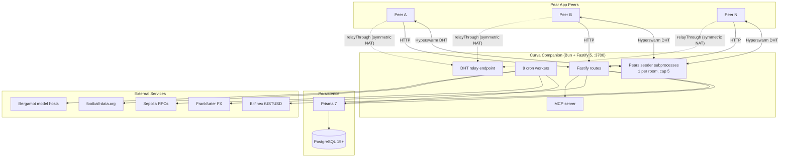
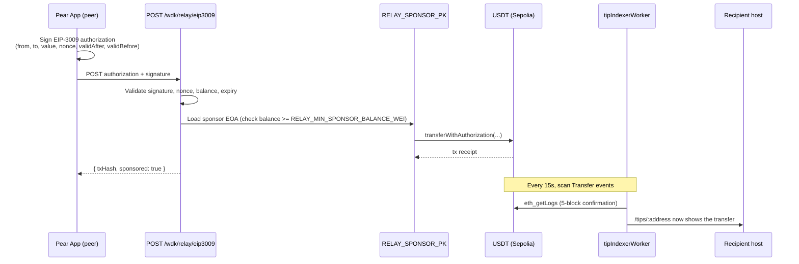

<div align="center">

# Curva Companion

**Public-good infrastructure for Curva.**

Optional server that seeds Pears rooms, indexes Sepolia tips, sponsors gasless USDT transfers, and mirrors QVAC translation models. Any peer can run their own. The Pear app never trusts it with chat, playhead, clips, or tips.

[Trust Boundary](#the-trust-boundary) · [Capabilities](#capabilities) · [Architecture](#architecture) · [Quick Start](#quick-start) · [Pre-Flight](#pre-flight-checklist-for-tether-cup-demo) · [Endpoints](#api-endpoints) · [Workers](#workers) · [Deployment](#deployment)


</div>

---

## The Trust Boundary

Curva is a P2P watch party. The Pear app is the source of truth. This backend is convenience, not authority.

**The Pear app trusts:**
- Its local Autobase view (chat, playhead sync, tip log ordering).
- Its local Hyperbee view (clip metadata, phrasebook state).
- Its local Hyperdrive blobs (clip payloads, room assets).
- On-chain Sepolia state (USDT transfers, verified by RPC directly from the peer when possible).

**The Pear app does NOT trust the Companion with:**
- Chat content.
- Playhead state.
- Clip storage.
- Tip authenticity (it cross-checks against on-chain state).

If this backend disappears, Curva keeps working. Any host can run their own Companion, and the wire protocol is unchanged. This is the model Tether uses for Keet's public seeders: infrastructure that helps, but is never load-bearing.

---

## Capabilities

| Match Catalog | Room Directory | WDK Facilitator | QVAC Registry |
|---|---|---|---|
| World Cup 2026 fixtures, teams, live pulses | Opt-in public list, host-signed delete via EIP-191 | Sponsors EIP-3009 `transferWithAuthorization` on Sepolia USDT | SHA-256 pinned Bergamot model mirror with EN-hub pivots |

| Tip Indexer | DHT Relay | Pears Seeder | Pear Distribution |
|---|---|---|---|
| Mirrors USDT Transfer events, 5-block confirmation, cursor pagination | `GET /relay/info` for symmetric-NAT peers | Optional subprocess per room, capped at 5 on 256 MB Fly VM | Manifest for `pear://` app updates |

| WDK Receipts | MCP Server | Fiat Pricing | Prediction Pools |
|---|---|---|---|
| Shareable HTML or JSON at `/wdk/verify/:txHash` | Public by default, bearer auth when `MCP_ACCESS_TOKEN` is set | Bitfinex + Frankfurter, 60 s cache | Match prediction pools, phrasebook, activity feed, leaderboard |

**Surface:** 21 route modules, 47 endpoints, 9 background workers. **Tests:** 414 of 414 pass, 1783 asserts.

---

## Architecture

### System Overview



### Facilitator Sequence (EIP-3009)



### Room Lifecycle

```mermaid
flowchart LR
    Register["POST /rooms<br/>slug, matchId, hostSmart, hostOwner"] --> Announce["Announce topic on Hyperswarm"]
    Announce --> Seed["Optional: seeder subprocess joins topic"]
    Seed --> Peers["Peers gossip Autobase / Hyperbee / Hyperdrive"]
    Peers --> Challenge["GET /rooms/:slug/delete-challenge<br/>returns nonce"]
    Challenge --> Sign["Host signs EIP-191<br/>'curva-delete:slug:nonce'"]
    Sign --> Delete["DELETE /rooms/:slug<br/>challenge + signature"]
    Delete --> SoftDelete[Row soft-deleted, seeder subprocess shuts down]
```



---

## How It Works

### Trust boundary and P2P source of truth

The Pear app carries the full Autobase, Hyperbee, and Hyperdrive state locally, synced peer-to-peer over Hyperswarm. Tips are cross-checked against on-chain Sepolia state by the peer directly. The Companion only mirrors public events and helps NATed peers find each other. Every endpoint the Companion exposes is safe to lose.

### WDK facilitator

`POST /wdk/relay/eip3009` accepts an `EIP-3009 transferWithAuthorization` signed by the peer's smart account. The Companion validates the signature, nonce single-use, expiry window, and USDT balance, then submits the call from `RELAY_SPONSOR_PK`. The sponsor pays gas in ETH; the peer sends USDT gaslessly. ERC-4337 UserOp submission is a fallback path when a paymaster is configured. A balance guard refuses to relay when the sponsor EOA falls below `RELAY_MIN_SPONSOR_BALANCE_WEI` (default 0.005 ETH), so the demo never silently no-ops.

### Tip indexer

`tipIndexerWorker` scans `Transfer` events on Sepolia USDT `0xd077a400968890eacc75cdc901f0356c943e4fdb` every 15 seconds. It confirms at 5 blocks, stores a `(blockNumber, logIndex)` cursor, and only surfaces tips where the `to` address matches a registered host. Cursor pagination on `GET /tips/:address` uses that same key. The peer still verifies each tip against on-chain state before trusting it.

### QVAC model mirror

`GET /qvac/registry` (aliased as `/qvac/models`) exposes the Bergamot translation catalog with English as the pivot hub, covering en, it, id, es, pt, de, fr in both directions. IT to ID composes through English (Bergamot IT to ID is not published upstream). Every other Curva Sud vs Nord language pair reaches its counterpart in at most two hops. Each entry carries a `contentDigest` pinned to the SHA-256 of the transport bytes so the peer can verify before loading; digests remain `null` until an operator runs `bun run verify:qvac-models`. `GET /qvac/explainer` returns a stable payload for the renderer's About screen (title, three bullets, attribution, upstream source URL). Rate-limited 60 per minute per IP, safe to cache at the edge.

### Optional Pears seeder subprocess

Set `ENABLE_SEEDER=true` to spawn one Hyperswarm subprocess per active room. The subprocess joins the room topic and keeps the swarm reachable when hosts sleep. `SEEDER_MAX_ROOMS` (default 5) caps concurrent seeders so a 256 MB Fly.io VM does not OOM. `seederReconcileWorker` keeps the subprocess set in sync with the rooms table every minute. Seeder noise identity is derived from `SEEDER_NOISE_SEED` (32-byte hex), generated by `bun run generate:secrets`.

### MCP server

`/mcp/*` implements a Model Context Protocol surface (info, resources, tools) that any agent can call. It is public by default so the "trillion agents transacting" narrative works out of the box. Set `MCP_ACCESS_TOKEN` for bearer auth; when set, every endpoint except `/mcp/info` requires `Authorization: Bearer <token>`. `MCP_TOOL_PREPARE_TIP_ENABLED` defaults to `false` and should only be enabled together with a token, because it exposes host smart-account addresses (OWASP API3:2023).

---

## Tech Stack

| Layer | Technology | Purpose |
|---|---|---|
| Runtime | Bun 1.1+ | ESM-first TypeScript runtime |
| HTTP | Fastify 5 | Router, plugins, hooks |
| Security | @fastify/helmet, @fastify/cors, @fastify/rate-limit | Baseline hardening |
| DB client | Prisma 7 with `@prisma/adapter-pg` | Query builder over Postgres |
| Database | PostgreSQL 15+ | Rooms, tips, matches, prediction pools |
| Scheduler | node-cron 3 | 9 background workers |
| EVM | Ethers 6 | RPC, signature verify, EIP-3009, EIP-191 |
| P2P crypto | hypercore-crypto, b4a | Seeder noise identity, buffer utils |
| Ingress | Bitfinex REST v2, Frankfurter, football-data.org | Pricing and fixtures |

---

## Project Structure

```
backend/
├── index.ts                    # Boot: routes, workers, plugins
├── dotenv.ts                   # Env loader
├── prisma/
│   └── schema.prisma
├── scripts/
│   ├── generate-secrets.ts     # SEEDER_NOISE_SEED + RELAY_SPONSOR_PK
│   ├── prewarm-models.ts       # Download pinned QVAC models
│   └── verify-qvac-models.ts   # Pin fresh SHA-256 contentDigests
├── seeder/
│   ├── bareSeeder.mjs          # Per-room Hyperswarm subprocess
│   └── topicForSlug.mjs
└── src/
    ├── config/main-config.ts   # Env config
    ├── data/
    │   ├── chains.json
    │   ├── phrasebook.json
    │   ├── qvac-models.json
    │   ├── world-cup-2026.json
    │   └── translations/{en,id,it}.json
    ├── routes/                 # 21 route modules
    ├── workers/                # 9 cron workers
    ├── lib/
    │   ├── evm/                # facilitator, indexer, EIP-3009, EIP-191
    │   ├── pears/              # seeder supervisor, distribution
    │   ├── mcp/                # server, tools, resources
    │   ├── i18n/               # locale-aware responses
    │   ├── integrations/       # football-data.org client
    │   ├── pricing/            # Bitfinex + Frankfurter
    │   ├── liveMatch/          # goal log
    │   └── activity/           # event bus
    └── utils/                  # validators, error handler
```

---

## Quick Start

**Prerequisites:** Bun 1.1+, PostgreSQL 15+, a Sepolia RPC URL.

```bash
# 1. Install deps
bun install

# 2. Copy env template and fill DATABASE_URL + SEPOLIA_RPC_URLS at minimum
cp .env.example .env

# 3. Push the Prisma schema (run this yourself, agents are not allowed to)
bun run db:push

# 4. Start the server
bun run dev
```

Server listens on `http://localhost:3700`. Verify:

```bash
curl http://localhost:3700/health | jq
```

---

## Pre-Flight Checklist for Tether Cup Demo

Run these steps in order on a fresh clone. Every step is idempotent.

1. **Generate secrets** (Pears seeder noise + Sepolia sponsor EOA):

   ```bash
   bun run generate:secrets
   ```

   Copy the printed `SEEDER_NOISE_SEED` and `RELAY_SPONSOR_PK` into `.env`. The private key is printed once and never persisted. Verify `.env` is in `.gitignore` before pasting.

2. **Fund the sponsor EOA on Sepolia.** Paste the address into either [Google Cloud Sepolia faucet](https://cloud.google.com/application/web3/faucet/ethereum/sepolia) or [pk910 Sepolia faucet](https://sepolia-faucet.pk910.de). Aim for at least 0.01 ETH; `RELAY_MIN_SPONSOR_BALANCE_WEI` defaults to 0.005 ETH.

3. **Prewarm QVAC models** (optional, no-op if every model is pending-upstream):

   ```bash
   bun run prewarm:models
   ```

   Downloads catalog entries with a pinned `contentDigest` into `./tmp/qvac-models`. Run `bun run verify:qvac-models` first if you need to pin fresh digests.

4. **Set the demo env flags** in `.env`:

   ```
   RELAY_SPONSOR_ENABLED=true
   ENABLE_SEEDER=true
   MODEL_MIRROR_ENABLED=true
   AUTO_WARM_HOST_OWNER_ADDRESS=0x...    # Sud host EOA
   AUTO_WARM_HOST_SMART_ADDRESS=0x...    # Sud host smart wallet
   DEMO_WALLET_SUD_OWNER=0x...
   DEMO_WALLET_SUD_SMART=0x...
   DEMO_WALLET_NORD_OWNER=0x...
   DEMO_WALLET_NORD_SMART=0x...
   PEAR_APP_KEY=<pear:// public key from `pear stage`>
   PEAR_APP_VERSION=0.1.0
   PEAR_APP_RELEASE_DATE=2026-07-15
   PEAR_DISTRIBUTION_ENABLED=true
   # MCP_TOOL_PREPARE_TIP_ENABLED defaults to false. Set to true ONLY when
   # MCP_ACCESS_TOKEN is also set, otherwise host smart-account addresses are
   # exposed to anonymous scrapers (OWASP API3:2023).
   MCP_ACCESS_TOKEN=<random-bearer-token>
   MCP_TOOL_PREPARE_TIP_ENABLED=true
   ```

5. **Apply the schema and boot** (schema push is manual per project policy):

   ```bash
   bun run db:push
   bun run start
   ```

6. **Smoke test** the health endpoint:

   ```bash
   curl http://localhost:3700/health | jq
   ```

   Expected: `data.facilitator.enabled === true` and every entry in `data.facilitator.balances[].balanceEth` above 0.005.

7. **Fire one facilitator tip** end-to-end, then pin the tx hash in `demo/README.md`. The hash is the artefact judges click through.

8. **Grab the shareable receipt URL for DoraHacks.** After the first sponsored tip lands, `/wdk/verify/:txHash` renders a public receipt card (JSON by default, HTML on `Accept: text/html`). Pin the URL in the DoraHacks submission description so judges can click through to a screenshot-friendly proof of the sponsored USDT transfer without running the app themselves.

9. **QVAC catalog now spans EN-hub Bergamot pairs.** `/qvac/registry` (served as `/qvac/models`) exposes English pivots for it, id, es, pt, de, fr in both directions. IT and ID demos still use a chained pivot through English (Bergamot IT to ID is not published upstream); every other Curva Sud and Nord language pair composes at most two hops. Content digests stay `null` until an operator runs `bun run verify:qvac-models` to pin the transport-byte SHA-256.

10. **`/qvac/explainer`** returns a stable payload for the renderer About screen (title, three bullets, attribution, upstream source URL). No auth. Rate-limited 60/min per IP. Safe to cache at the edge.

Once every step returns green, the demo is ready.

---

## Environment Variables

| Var | Required | Notes |
|---|---|---|
| `DATABASE_URL` | yes | Postgres connection string |
| `SEPOLIA_RPC_URLS` | yes | Comma-separated RPC URLs, first preferred. Public defaults work |
| `SEEDER_NOISE_SEED` | yes | 32-byte hex seed for seeder noise key, from `generate:secrets` |
| `JWT_SECRET` | yes | Kept for compatibility, not used by Curva endpoints |
| `RELAY_SPONSOR_PK` | facilitator | Sepolia EOA private key that sponsors gasless USDT transfers |
| `FACILITATOR_ENABLED` | facilitator | Enables `/wdk/relay/eip3009` route family |
| `RELAY_MIN_SPONSOR_BALANCE_WEI` | facilitator | Refuse-to-relay threshold, default `5000000000000000` (0.005 ETH) |
| `ENABLE_SEEDER` | seeder | Spawns one Hyperswarm subprocess per active room |
| `SEEDER_MAX_ROOMS` | seeder | Concurrency cap, default `5` for 256 MB VMs |
| `MODEL_MIRROR_ENABLED` | qvac | Enables `modelMirrorSyncWorker` and pinned mirror |
| `PEAR_APP_KEY` | distribution | `pear://` public key from `pear stage` |
| `PEAR_DISTRIBUTION_ENABLED` | distribution | Enables `/distribution` manifest route |
| `MCP_ACCESS_TOKEN` | mcp | Bearer token for `/mcp/*`. When unset, endpoints are public |
| `MCP_TOOL_PREPARE_TIP_ENABLED` | mcp | Exposes prepare-tip tool. Only enable together with `MCP_ACCESS_TOKEN` |
| `TRUST_PROXY_HOPS` | prod | Numeric, default `1`. Increase only for known multi-proxy chains |
| `FOOTBALL_DATA_API_KEY` | optional | Live fixture refresh from football-data.org free tier |
| `PRICING_RATE_LIMIT_MAX` | optional | Default 60 req/min per IP |

---

## API Endpoints

All responses use the envelope `{ success, error, data }`. Error code is in `error.code`.

| Category | Method | Path | Notes |
|---|---|---|---|
| Match catalog | GET | `/matches` | Paginated, filters: `stage`, `status`, `from`, `to` |
| | GET | `/matches/today` | Now minus 2h to now plus 24h |
| | GET | `/matches/:id` | cuid or external numeric id |
| | GET | `/matches/:id/live` | Live pulse for a match |
| | GET | `/teams`, `/teams/:code` | Team catalog |
| Room directory | POST | `/rooms` | Rate-limited 5/min/IP, `hostSmartAddress` + `hostOwnerAddress` required |
| | GET | `/rooms`, `/rooms?matchId=` | List |
| | GET | `/rooms/:slug` | Single |
| | GET | `/rooms/:slug/peers` | Live peer count from seeder telemetry |
| | GET | `/rooms/:slug/delete-challenge` | Returns nonce for EIP-191 sign |
| | DELETE | `/rooms/:slug` | Body: `{ challenge, signature }` |
| Tip indexer | GET | `/tips/:address` | Cursor pagination via `cursor=<block>_<logIndex>` |
| | GET | `/tips/:address/total` | Aggregated total |
| | GET | `/tips/by-room/:slug` | Room-scoped tips |
| DHT relay | GET | `/relay/info` | `{ pubkey, swarmKey, regions }` |
| WDK facilitator | POST | `/wdk/relay/eip3009` | Sponsored `transferWithAuthorization` |
| WDK receipts | GET | `/wdk/verify/:txHash` | JSON default, HTML on `Accept: text/html` |
| QVAC | GET | `/qvac/models`, `/qvac/registry` | Bergamot mirror with `contentDigest` |
| | GET | `/qvac/explainer` | Stable payload for the About screen |
| Distribution | GET | `/distribution` | Pear app manifest |
| MCP | GET | `/mcp/info` | Always public |
| | POST | `/mcp/tools/*`, `/mcp/resources/*` | Bearer required when `MCP_ACCESS_TOKEN` is set |
| Pricing | GET | `/pricing/usdt?currency=IDR` | Bitfinex + Frankfurter, 60 s cache, 60/min/IP |
| Health | GET | `/health` | Aggregate: db, seeder, indexer, catalog, facilitator |
| | GET | `/health/db` | Postgres ping |
| | GET | `/metrics/live` | Demo-dashboard aggregate |
| | GET | `/status` | Build and version metadata |

Additional route modules: `activityRoutes`, `attendanceRoutes`, `chainsRoutes`, `dashboardRoutes`, `demoRoutes`, `leaderboardRoutes`, `phrasebookRoutes`, `predictionRoutes`, `tokenDomainRoutes`, `x402Routes`. Total: 21 modules, 47 endpoints.

### Example: register a room

```bash
curl -X POST http://localhost:3700/rooms \
  -H 'Content-Type: application/json' \
  -d '{
    "slug":"arg-vs-ita-r16",
    "matchId":"<a match cuid from /matches>",
    "hostHandle":"curva-host",
    "hostSmartAddress":"0xYourSafeAddress",
    "hostOwnerAddress":"0xYourOwnerEOA",
    "pearLink":"pear://curva?room=arg-vs-ita-r16"
  }'
```

Reserved slug prefixes: `auto-*` slugs are owned by `matchAutoWarmWorker`. Attempts to register one return `400 RESERVED_SLUG_PREFIX`.

### Example: delete a room (host-only)

```bash
# 1. Request a challenge
curl http://localhost:3700/rooms/arg-vs-ita-r16/delete-challenge
# -> data.signPayload = "curva-delete:arg-vs-ita-r16:<nonce>"

# 2. Sign the payload with the host's WDK owner EOA (EIP-191 personal_sign)
#    const sig = await account.signMessage(signPayload)

# 3. Submit
curl -X DELETE http://localhost:3700/rooms/arg-vs-ita-r16 \
  -H 'Content-Type: application/json' \
  -d '{"challenge":"<nonce>","signature":"0x..."}'
```

---

## Workers

Nine cron workers run automatically on boot.

| Worker | Cron | Job |
|---|---|---|
| `catalogSyncWorker` | `0 */6 * * *` | Re-seed teams and matches from JSON, refresh from football-data.org when key is set |
| `tipIndexerWorker` | `*/15 * * * * *` | Scan Sepolia USDT Transfer events to registered hosts, 5-block confirmation |
| `liveMatchPulseWorker` | `*/30 * * * * *` | Update live match pulses and goal log |
| `matchAutoWarmWorker` | `*/5 * * * *` | Pre-provision `auto-*` rooms for imminent matches |
| `modelMirrorSyncWorker` | `0 */12 * * *` | Sync QVAC Bergamot models against pinned digests |
| `relayConfirmationWorker` | `*/20 * * * * *` | Track facilitator tx confirmations for receipt cards |
| `roomCleanupWorker` | `*/10 * * * *` | Soft-delete expired rooms (hard-delete is a manual ops action) |
| `seederReconcileWorker` | `* * * * *` | Reconcile seeder subprocesses against the rooms table |
| `errorLogCleanup` | `0 * * * *` | Cap `error_logs` at 10 000 rows |

A tenth worker, `predictionSettlementWorker`, settles prediction pools when match results finalize.

---

## Testing

```bash
bun test
```

414 of 414 pass, 1783 asserts. Tests are pure-unit + route-level with stub Prisma (no DB required). Seeder subprocess and live RPC paths are reviewed by inspection, since running them under test would require a live Postgres and a Sepolia node, both out of scope for the hackathon.

---

## Deployment

### Fly.io (recommended, UDP support for Hyperswarm)

```toml
# fly.toml excerpt
[build]
  dockerfile = "Dockerfile"

[env]
  NODE_ENV = "production"
  APP_PORT = "3700"

[[services]]
  internal_port = 3700
  protocol = "tcp"
  [[services.ports]]
    port = 443
    handlers = ["tls", "http"]

# Add a second [[services]] block for UDP if running the seeder:
[[services]]
  internal_port = 49737
  protocol = "udp"
  [[services.ports]]
    port = 49737
```

```bash
fly secrets set DATABASE_URL=... SEPOLIA_RPC_URLS=... SEEDER_NOISE_SEED=...
fly deploy
```

### Railway (fallback, no native UDP)

Suitable when `ENABLE_SEEDER=false`. The catalog, room directory, tip indexer, facilitator, receipts, QVAC, MCP, pricing, and relay-info endpoints all work without the seeder subprocess.

### Render

Avoid. Free tier sleeps after 15 minutes of inactivity, which kills the seeder and stalls workers.

### Dockerfile

The `Dockerfile` is Bun-based (`oven/bun:1`), installs with `bun install --frozen-lockfile`, runs `bunx prisma generate` at build time, and starts via `bun run index.ts`. The seeder subdirectory is included so flipping `ENABLE_SEEDER=true` at runtime works without a rebuild. See `.dockerignore` for excluded paths.

### Proxy and IP trust

`trustProxy` is numeric (`TRUST_PROXY_HOPS`, default `1`). This means the app trusts exactly one front-facing proxy hop when resolving `request.ip` from `X-Forwarded-For`. Increase this only if the deployment has more than one trusted proxy in front of the app. Boolean `true` is unsafe and lets attackers spoof per-IP rate limits. See `SECURITY_AUDIT.md` HIGH-01.

---

## Security Baseline

- All endpoints input-validated server-side (`src/utils/curvaValidators.ts`).
- Rate limits on `POST /rooms` (5/min/IP), `DELETE /rooms/:slug` (10 per 5 min per IP), `/pricing/*` (60/min/IP), `/qvac/explainer` (60/min/IP).
- CORS allowlist, no `*` in production. `pear://` and `localhost` allowed for the Pear runtime.
- 1 MB body limit.
- Generic error messages to clients, full details only in server logs.
- Numeric trust proxy, real client IP resolved from `X-Forwarded-For` for rate limit and error log.
- No raw SQL string concatenation, all Prisma parameterized queries.
- Delete-challenge nonces single-use with 5-minute TTL.
- EIP-3009 authorizations validated for signature, nonce, balance, and expiry before sponsor submission.
- MCP prepare-tip tool gated behind bearer auth to avoid leaking host smart-account addresses (OWASP API3:2023).

---

## Local Two-Peer Demo

1. Start the backend with the seeder enabled:
   ```bash
   ENABLE_SEEDER=true bun run dev
   ```
2. In another terminal, look up a match id:
   ```bash
   curl -s http://localhost:3700/matches/today | jq '.data.matches[0].id'
   ```
3. Register a room with that match id and your test wallet address.
4. Poll `GET /rooms/<slug>/peers`. Once two Pear peers join the topic, `peerCount` increments.
5. Send a 0.01 USDT Sepolia transfer to the registered host address. Within about 30 seconds it appears in `GET /tips/<address>`.

---

## References

- Architecture spec: [`ARCHITECTURE.md`](./ARCHITECTURE.md)
- Backend conventions: [`CLAUDE.md`](./CLAUDE.md)
- Project root: [`../README.md`](../README.md)

---

<div align="center">

**Built for Tether Developers Cup 2026 · Pears track · Indonesia**

Final: 2026-07-15

</div>
