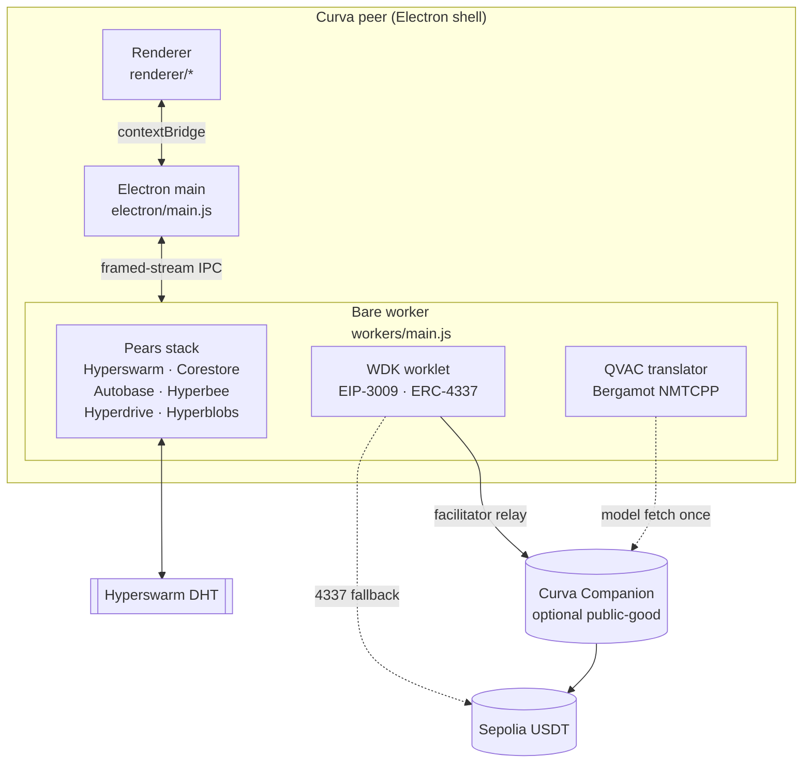
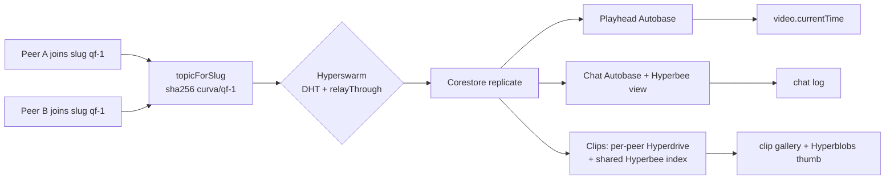
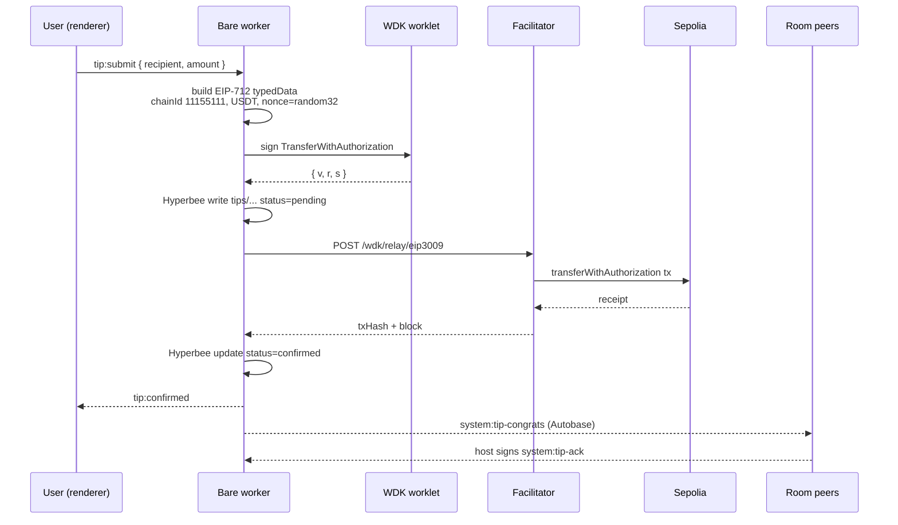

<div align="center">

# Curva

**Watch the World Cup with friends, peer-to-peer.**

A fully P2P watch-party desktop app. Pears (Holepunch) is the whole distribution. No streaming platform, no chat server, no cloud translator, no custodian.

[Judge quick-start](#judge-quick-start) · [Why Curva](#why-curva) · [Capabilities](#capabilities) · [Architecture](#architecture) · [How it works](#how-it-works) · [Quick start](#quick-start) · [Publishing](#publishing) · [Testing](#testing)


</div>

> **For code reviewers.** Start at [`../CODE_REVIEW.md`](../CODE_REVIEW.md) at the
> repo root. It maps every wave 2 to 5 feature to a file:line anchor, groups
> tests by concern, lists what we deliberately did not build, and gives the
> feature-flag boot matrix so you can pick a subset for a shallow pass or the
> full set for a deep dive.

---

## Judge quick-start

**Zero-install path.** If the Pear runtime is installed, one command boots the live app:

```sh
npm i -g pear
pear run pear://hcg8oftrk7hps1z4x9pprf4jhk7mitohjort6csfpjwjjo3ynomy
```

**From source (Node 20+, macOS Apple Silicon / Linux / Windows).**

```sh
cd pear-app
npm install
npm run start
```

`npm run start` launches Electron with OTA updates disabled so local iteration is stable.

**Four-peer split-screen demo (the same rig used in the video).**

```sh
CURVA_DEMO=4 npm run demo:4peer     # 2x2 grid, four independent peers on one machine
CURVA_DEMO=2 npm run demo:4peer     # two peers side-by-side
```

Each peer gets its own storage root under `.demo-store/{a,b,c,d}` so they behave as fully independent Curva instances. Add `-- --clean` to wipe stores before booting.

**Prebuilt installer.** If a `.dmg` / `.deb` / `.rpm` / `.zip` is attached to the DoraHacks submission it is unsigned. Verify the SHA-256 in the submission thread. GitHub Releases: <https://github.com/curva-app/curva/releases> (populated at submit time).

---

## Why Curva

FIFA does not sell a global watch-party product. Fans have to choose between joining a Discord (chat lives on someone else's server), booting a Zoom (video is centralised, chat is centralised, you pay), or texting friends timestamps while everyone drifts out of sync.

Curva removes every middleman:

- **No FIFA broadcast platform.** Each peer plays a local file; the playhead is what syncs.
- **No chat server.** Chat is an Autobase, replicated peer-to-peer.
- **No cloud translator.** QVAC Bergamot runs on-device with SHA-256 pinned models.
- **No custody.** Tips settle on-chain in USDT via WDK. The user holds the seed.

The Curva Companion backend is optional public-good infrastructure. If it goes dark, rooms still work, tips still work, clips still replicate.

---

## Capabilities

| 1. Synced playback | 2. Multi-writer chat | 3. Gasless tipping | 4. On-device translation |
|---|---|---|---|
| Autobase-linearised playhead. Sub-second sync between peers on separate continents, verified against a `pear-runtime@1.3.1` sidecar. | Autobase Pattern B: peers request writer status, host signs an ed25519 invitation, `base.addWriter` is called. Chat survives host disconnect. | EIP-3009 signed by the peer's EOA, relayed by a facilitator. ERC-4337 Safe smart account via Candide bundler as fallback. Sepolia USDT `0xd077a400968890eacc75cdc901f0356c943e4fdb`. | QVAC Bergamot with `modelConfig.pivotModel`. 12 EN-hub pairs. Italian into Bahasa Indonesia pivots IT-EN-ID in one `pivotMultiple` call. |

---

## Architecture

### System overview



The renderer is Chromium. It holds no keys, no P2P state, no crypto. It talks to a single Bare worker over a `framed-stream` IPC. That worker owns the entire Pears stack, the WDK wallet worklet, and the QVAC translator.

### Room join



### Tip flow (EIP-3009 primary path)



If the facilitator is unreachable, `bare/wallet/worklet.js` falls back to `account.transfer()` through the Candide bundler at `https://api.candide.dev/public/v3/11155111` with `onChainIdentifier: 'curva'`.

Full ADRs, IPC contract, and phase log live in [ARCHITECTURE.md](./ARCHITECTURE.md).

---

## How it works

### Pears building blocks

Nine primitives, all doing real work.

| Building block | File | Purpose |
|----------------|------|---------|
| Hyperswarm | `bare/swarmLifecycle.js` | Match-room discovery on sha256 topic, `relayThrough` NAT fallback |
| Corestore | `bare/room.js` | One disk root, many named cores per room |
| Hypercore | `bare/playhead.js`, `bare/chat.js`, `bare/clips.js` | Named cores for playhead, chat, clips, room state |
| Autobase | `bare/playhead.js`, `bare/chat.js`, `bare/writerInvitation.js` | Multi-writer playhead + chat, Pattern B addWriter |
| Hyperbee | `bare/chat.js`, `bare/room.js`, `bare/tip.js` | Chat view, room state, tip log, writer roster, reactions bucket |
| Hyperdrive | `bare/clips.js` | Per-peer clip filesystem, `findingPeers` cold-start |
| Hyperblobs | `bare/clips.js` | 128x72 ffmpeg-baseline clip thumbnails |
| hypercore-crypto | `bare/topics.js`, `bare/writerInvitation.js` | Topic derivation, ed25519 writer invitations |
| pear-runtime updater | `electron/main.js` | OTA renderer toast; Companion also runs a permanent seeder daemon |

### WDK dual-path tipping

**Packages.** `@tetherto/wdk` ^1.0.0-beta.12, `@tetherto/wdk-wallet-evm-erc-4337` ^1.0.0-beta.10, `@tetherto/wdk-secret-manager` ^1.0.0-beta.3.

**Chain.** Sepolia, chainId `11155111`. USDT at `0xd077a400968890eacc75cdc901f0356c943e4fdb`.

**Path A, EIP-3009 (primary).** Peer EOA signs `TransferWithAuthorization`. Backend facilitator submits. 2 to 6 seconds to receipt. See `bare/wallet/eip3009.js`.

**Path B, ERC-4337 (fallback).** Safe smart account via `WalletManagerEvmErc4337`. `account.transfer()` routes through Candide bundler + paymaster. `onChainIdentifier: 'curva'` appended per WDK docs (50-byte project marker on UserOperation calldata). See `bare/wallet/worklet.js`.

**Secret storage.** Seed encrypted at rest via `@tetherto/wdk-secret-manager` (PBKDF2 + XSalsa20-Poly1305). Passcode gate enforced by `renderer/components/PasscodePrompt.js`. The passcode travels renderer → preload → IPC → worker in one direction and is never emitted back.

### QVAC on-device translation

**Packages.** `@qvac/sdk` ^0.14.0 plus the `@qvac/translation-nmtcpp` runtime addon.

**Pivot pattern.** 12 EN-hub Bergamot pairs are staged in the Companion's QVAC registry. When a peer sends Italian in a Jakarta room, the receiver loads `bergamot-it-en` with `pivotModelPath` pointing to `bergamot-en-id`; the SDK's `BlockingService::pivotMultiple` pivots through English in a single call. See `bare/translate.js` lines 208 to 229.

**Integrity.** SHA-256 hashes of every model are pinned in the QVAC catalog served by the backend. `bare/translate.js` verifies on-device before load.

**Privacy.** Zero network calls during translation. The model file is fetched once (mirrored by the backend `modelMirrorSyncWorker`) and cached in the Pear app data directory.

### Bare worker architecture

- **`electron/main.js`** spawns the Bare worker with `PearRuntime.run(specifier, argv)` and wires a `FramedStream` pipe on top of the child's stdio.
- **`electron/preload.js`** exposes `window.bridge` via `contextBridge` (no `nodeIntegration`). Renderer only ever sees this bridge.
- **`workers/main.js`** loads the P2P subsystem (`bare/room.js` etc.), the WDK wallet worklet, and the QVAC translator. Wallet seed lives in worker module scope (ADR-004) and is never emitted back to the renderer.
- **`workers/wallet.js`** exists as a reserved separate-process wallet worker for the v2 hardening path. Current release keeps the wallet in-process for demo simplicity.

---

## Tech stack

| Layer | Technology | Purpose |
|---|---|---|
| Shell | Electron 40.2.1 (dev), Pear runtime 1.3.1 (dist) | Window, single-instance lock, OTA update host |
| Worker | Bare via `pear-runtime` | P2P subsystem, WDK, QVAC isolated from Chromium |
| IPC | `framed-stream` 1.0.1 | Length-prefixed JSON between renderer, main, worker |
| P2P discovery | `hyperswarm` 4.17, `hypercore-crypto` 3.7 | Topic-hashed room membership |
| P2P storage | `corestore` 7.11, `hyperbee` 2.27, `hyperdrive` 13.3, `hyperblobs` 2.12 | Per-peer stores, views, drives, thumbnails |
| Consensus | `autobase` 7.28 | Multi-writer playhead + chat (Pattern B) |
| Blind peering | `blind-peering` 2.4 | Companion seeder attachment |
| Wallet | `@tetherto/wdk` beta.12, `@tetherto/wdk-wallet-evm-erc-4337` beta.10, `@tetherto/wdk-secret-manager` beta.3, `ethers` 6.13 | EIP-3009 sign, ERC-4337 fallback, encrypted seed |
| Translation | `@qvac/sdk` 0.14 + `nmtcpp` addon | Bergamot with `pivotModel` |
| CLI + args | `paparam` 1.10, `which-runtime` 1.4 | Runtime detection, flag parsing |
| Tests | `brittle` 4.0 | Tap-style test runner used across Pears repos |
| Packaging | `@electron-forge/*` 7.11 | `.dmg`, `.deb`, `.rpm`, `.zip` installers |

---

## Project structure

```
pear-app/
  electron/         Electron main process + preload bridge
    main.js         PearRuntime.run + FramedStream IPC
    preload.js      contextBridge window.bridge surface
  renderer/         Chromium UI (no build step, ES modules)
    app.js          bootstrap + wires bridge
    components/     VideoPlayer, Chat, ClipGallery, TipButton,
                    TranslationToggle, PasscodePrompt, ...
    lib/            bridge wrapper, backend client
  bare/             P2P modules loaded by the Bare worker
    room.js         Corestore + Autobase + Hyperbee lifecycle
    playhead.js     Autobase playhead reducer
    chat.js         Autobase chat + Hyperbee view + goal cluster
    clips.js        Hyperdrive + shared index + Hyperblobs thumb
    tip.js          EIP-712 typedData build + facilitator POST
    translate.js    QVAC Bergamot + pivotMultiple
    swarmLifecycle.js   Hyperswarm + relayThrough
    topics.js       sha256 topic derivation
    wallet/         WDK worklet + EIP-3009 helpers
  workers/          Bare entry files spawned by Electron main
    main.js         Bare worker entry
    wallet.js       Reserved for v2 out-of-process wallet
  scripts/          demo-4peer.js, reencode-sample-clip.sh, postinstall shims
  assets/           sample-clip.mp4, bergamot models, icons, themes
  test/             brittle tests (see Testing)
```

---

## Quick start

### Pre-flight checklist

Work through this before `npm start` or the two-peer demo:

1. **Backend Companion running.**
   ```sh
   cd ../backend && bun run dev
   ```
   Verify `curl http://localhost:3700/health` returns `success: true`, and that `data.facilitator.enabled` is `true` if you want live tipping.
2. **Backend feature flags** (set in `backend/.env` before starting):
   - `FACILITATOR_ENABLED=true` and `FACILITATOR_SPONSOR_PK=0x<key>` for real tips.
   - `PEAR_DISTRIBUTION_ENABLED=true` and `PEAR_APP_KEY=pear://...` for QR invite links; the app falls back to `curva://room/<slug>` when off.
   - `FOOTBALL_DATA_TOKEN=...` for real match events (optional).
3. **Sample match video.** Drop any MP4 at `pear-app/assets/sample-clip.mp4`. `scripts/reencode-sample-clip.sh <path-to-source.mp4>` converts an arbitrary source into the codec profile the demo expects (H.264 baseline + AAC LC).
4. **Clip thumbnails.** Install ffmpeg (`brew install ffmpeg`, `apt install ffmpeg`). Otherwise Curva shows a placeholder. Force placeholder in headless environments with `CURVA_CLIP_THUMBS_FFMPEG=off`.
5. **Bergamot IT-ID model (optional, QVAC demo).** Fetch it into `pear-app/assets/bergamot-it-id/`:
   ```sh
   mkdir -p assets/bergamot-it-id && cd assets/bergamot-it-id \
     && curl -L -O https://github.com/mozilla/firefox-translations-models/raw/main/models/prod/iten/model.iten.intgemm.alphas.bin \
     && curl -L -O https://github.com/mozilla/firefox-translations-models/raw/main/models/prod/iten/lex.50.50.iten.s2t.bin \
     && curl -L -O https://github.com/mozilla/firefox-translations-models/raw/main/models/prod/iten/vocab.iten.spm
   ```
   The IT-ID pair is `pending-upstream` in the QVAC registry; without local models the translator falls back to showing originals.
6. **Wallet passcode.**
   - Dev shortcut: `export DEV_WALLET_PASSCODE=curva-dev-pw` before `npm start`.
   - Otherwise the app prompts on first run via `PasscodePrompt`. Enter a 6 to 128 char string; it is stored encrypted on disk by `@tetherto/wdk-secret-manager`.

### Install (judges + testers)

```sh
npm i -g pear
pear run pear://<CURVA_APP_KEY>
```

The current app key is published at `https://curva.app/distribution` (backed by the Companion `GET /distribution` endpoint) and pinned in the DoraHacks submission.

### Develop

```sh
git clone https://github.com/<owner>/curva.git
cd curva/pear-app
npm install
npm start
```

`npm start` runs the app under Electron with OTA updates disabled (`--no-updates`) so local development is stable.

### Two-peer local demo

Open two windows with separated storage so they behave as independent peers.

Terminal 1:
```sh
npm run seed:peer-a
```

Terminal 2:
```sh
npm run seed:peer-b
```

Each script passes `--storage ./.store-peer-<x>` so that instance has its own Corestore, wallet seed, and Autobase writer identity. Type a match slug in the room bar (e.g. `qf-1`) and press Join. Both windows connect on `crypto.data(b4a.from('curva/qf-1'))`, replicate playhead, chat, and clips, and stay in sync.

### Four-peer reproducible demo

```sh
npm run demo:4peer
```

Runs `scripts/demo-4peer.js`, which spawns four Electron instances with staggered storage roots, joins them into the same room, and drives a scripted playhead + chat + tip scenario. Used for judged rehearsal and CI smoke.

### Full feature demo (semifinal max-out)

Boot each peer with EVERY wave 2 to 4 QVAC feature and observability turned on. This is the exact command used for the semifinal recording; every flag exercises a real code path shipped by waves 2, 3, and 4.

**Peer A (host).** Fresh storage under `/tmp/curva-peer-a-fresh`, backend at `localhost:3700`:

```sh
cd pear-app && \
  DEV_WALLET_PASSCODE=curva-peer-a-pw \
  CURVA_DEMO_MODE=true \
  CURVA_FORCE_RELAY=1 \
  CURVA_KEET_IDENTITY_ENABLED=true \
  CURVA_MULTIWRITER=true \
  \
  CURVA_QVAC_COMMENTATOR_ENABLED=true \
  CURVA_QVAC_STT_ENABLED=true \
  CURVA_QVAC_TTS_ENABLED=true \
  CURVA_QVAC_LLM_TRANSLATE_ENABLED=true \
  \
  CURVA_PREDICTIONS_ENABLED=true \
  CURVA_ATTENDANCE_ENABLED=true \
  CURVA_DELEGATED_INFERENCE_ENABLED=true \
  CURVA_TACTICAL_ENABLED=true \
  CURVA_DEMO_HUD_ENABLED=true \
  \
  CURVA_OBSERVABILITY_ENABLED=true \
  CURVA_PROMETHEUS_PORT=4343 \
  \
  CURVA_ASK_FRAME_ENABLED=true \
  CURVA_LANGDETECT_ENABLED=true \
  CURVA_SEMSEARCH_ENABLED=true \
  CURVA_GOAL_CARD_ENABLED=true \
  \
  CURVA_APPLY_MIDDLEWARE_ENABLED=true \
  CURVA_GOAL_PIPELINE_ENABLED=true \
  CURVA_VLM_PREFILTER_ENABLED=true \
  \
  npx electron-forge start -- --no-updates \
    --storage /tmp/curva-peer-a-fresh \
    --no-auto-open \
    --backend http://localhost:3700
```

**Peer B (viewer).** Same flags, different passcode and storage root:

```sh
cd pear-app && \
  DEV_WALLET_PASSCODE=curva-peer-b-pw \
  CURVA_DEMO_MODE=true \
  CURVA_FORCE_RELAY=1 \
  CURVA_KEET_IDENTITY_ENABLED=true \
  CURVA_MULTIWRITER=true \
  \
  CURVA_QVAC_COMMENTATOR_ENABLED=true \
  CURVA_QVAC_STT_ENABLED=true \
  CURVA_QVAC_TTS_ENABLED=true \
  CURVA_QVAC_LLM_TRANSLATE_ENABLED=true \
  \
  CURVA_PREDICTIONS_ENABLED=true \
  CURVA_ATTENDANCE_ENABLED=true \
  CURVA_DELEGATED_INFERENCE_ENABLED=true \
  CURVA_TACTICAL_ENABLED=true \
  CURVA_DEMO_HUD_ENABLED=true \
  \
  CURVA_OBSERVABILITY_ENABLED=true \
  CURVA_PROMETHEUS_PORT=4344 \
  \
  CURVA_ASK_FRAME_ENABLED=true \
  CURVA_LANGDETECT_ENABLED=true \
  CURVA_SEMSEARCH_ENABLED=true \
  CURVA_GOAL_CARD_ENABLED=true \
  \
  CURVA_APPLY_MIDDLEWARE_ENABLED=true \
  CURVA_GOAL_PIPELINE_ENABLED=true \
  CURVA_VLM_PREFILTER_ENABLED=true \
  \
  npx electron-forge start -- --no-updates \
    --storage /tmp/curva-peer-b-fresh \
    --no-auto-open \
    --backend http://localhost:3700
```

**Backend companion** (separate terminal, needs the wave 3 observability + shared RAG routes):

```sh
cd backend && \
  ENABLE_BACKEND_METRICS=true \
  ENABLE_SHARED_RAG=true \
  bun run dev
```

**Left intentionally OFF** (heavy first-run downloads; toggle on when you want to test them explicitly):

- `CURVA_VOICE_CLONE_ENABLED` — Chatterbox voice clone (~200 MB, EN/IT only)
- `CURVA_DIARIZE_ENABLED` — Parakeet Sortformer diarization (~150 MB)
- `CURVA_CHAOS_ENABLED` — deterministic node-drop for divergence testing
- `ENABLE_QVAC_PROVIDER` — backend as delegated QVAC provider (needs `@qvac/sdk` installed on backend host)

**What each flag activates** (from the wave-3 and wave-4 code review round):

| Flag | Feature |
|------|---------|
| `CURVA_OBSERVABILITY_ENABLED` + `CURVA_PROMETHEUS_PORT` | hypertrace + Prometheus loopback exporter, DiagnosticsPanel Metrics tab |
| `CURVA_ASK_FRAME_ENABLED` | `?` hotkey overlay: VLM caption → RAG → LLM → TTS orchestration |
| `CURVA_LANGDETECT_ENABLED` | Auto Bergamot pair selection via `@qvac/langdetect-text` |
| `CURVA_SEMSEARCH_ENABLED` | `srch` button in Chat header, semantic search via `sdk.embed()` |
| `CURVA_GOAL_CARD_ENABLED` | LLM structured output via `responseFormat.json_schema` |
| `CURVA_APPLY_MIDDLEWARE_ENABLED` | Autobase apply-middleware chain (audit log + chaos + system guard + replay) |
| `CURVA_GOAL_PIPELINE_ENABLED` | 6-capability marquee flow (OCR → goalCard → MCP → Bergamot → TTS → Autobase) |
| `CURVA_VLM_PREFILTER_ENABLED` | MobileNetV3 pre-filter skips non-match frames before VLM |
| `ENABLE_BACKEND_METRICS` | Backend Prometheus federation on `GET /metrics` |
| `ENABLE_SHARED_RAG` | FIFA 2026 fixtures RAG service on `POST /rag/search` |

---

## Publishing

```sh
npm run pear:stage      # pear stage dev .
npm run pear:release    # pear release dev .
npm run pear:seed       # pear seed dev .
```

Capture the returned `pear://<CURVA_APP_KEY>` and paste it into `backend/.env` as `PEAR_APP_KEY`, then hard-refresh the backend so the QR strip picks it up. The Companion's F13 distribution seeder keeps the app available even when the developer's laptop is asleep.

Do not run these mid-demo. Cut the release before the pitch window.

---

## Testing

```sh
npm test
```

Uses [brittle](https://github.com/holepunchto/brittle) as the runner (same as every Pear reference app).

**Status: 423 / 423 pass, 1,634 asserts green** (after waves 2 to 4 shipped: voice coach, VLM captioning, OCR, Chatterbox voice clone, JSON-schema goal card, langdetect, ask-the-frame, Parakeet diarization, semantic search, Autobase view.checkout, Hyperbee sub(), hypercore encryption, hypertrace + Prometheus federation, hypercore-stats + hyperswarm-stats + hyperdht-stats, apply middleware chain, goal pipeline, MobileNetV3 pre-filter, live Models panel).

---

## Known limitations

Honest checklist for the Cup submission window:

- **Chat sync one-way (B to A) in some sessions.** Fix in progress, target 2026-07-15.
- **Translation cold boot is slow.** First open of the QVAC pipeline downloads ~500 MB of Bergamot + Whisper + Supertonic + Qwen3 0.6B models. Subsequent runs are instant. Judges on hotel WiFi should expect a few minutes on first `pear run`.
- **Wallet balance refresh has latency.** After a sponsored tip lands on-chain it can take up to 30 seconds for the peer's balance widget to reflect. The tx hash is available immediately in the tip receipt.
- **Blind peer runs on the host laptop.** Rooms survive host disconnect only as long as the machine running the blind peer stays online.
- **Unsigned desktop builds.** macOS Gatekeeper will warn on first open of any `.dmg` we ship.

## Two-peer cross-machine test

Full walkthrough in [`../CROSS_MACHINE_TEST.md`](../CROSS_MACHINE_TEST.md). Short version:

1. On machine A: `pear run pear://hcg8oftrk7hps1z4x9pprf4jhk7mitohjort6csfpjwjjo3ynomy`, join room `qf-1`.
2. On machine B (separate network): same command, same slug.
3. Watch chat, playhead, and tip receipts replicate over the Hyperswarm DHT plus blind peer.

## Backend Companion

The Pear app is the source of truth for chat, playhead, clips, and tip log. The Companion (see [`../backend/`](../backend/)) is optional public-good infrastructure the app consumes but never trusts:

- Match catalog (`GET /matches`, `GET /matches/today`)
- Public room directory (`POST /rooms`, `GET /rooms`)
- WDK EIP-3009 facilitator (`POST /wdk/relay/eip3009`)
- QVAC model registry (`GET /qvac/models`)
- Pear app distribution manifest (`GET /distribution`)
- 24/7 room seeder so peers keep replicating when the host is offline
- DHT relay endpoint for symmetric-NAT peers

When the Companion is unreachable, rooms are still discoverable via `pear://curva?room=<slug>` links, tips still work via the direct bundler path, and everything peer-to-peer keeps functioning.

---

## Architecture doc

Deep-dive into IPC contracts, reducer sketches, ADRs, and threat model: [ARCHITECTURE.md](./ARCHITECTURE.md).

---

<div align="center">

**Tether Developers Cup 2026 · Pears track · Indonesia**
Final live pitch: **2026-07-15**

MIT © 2026 Curva contributors

</div>
