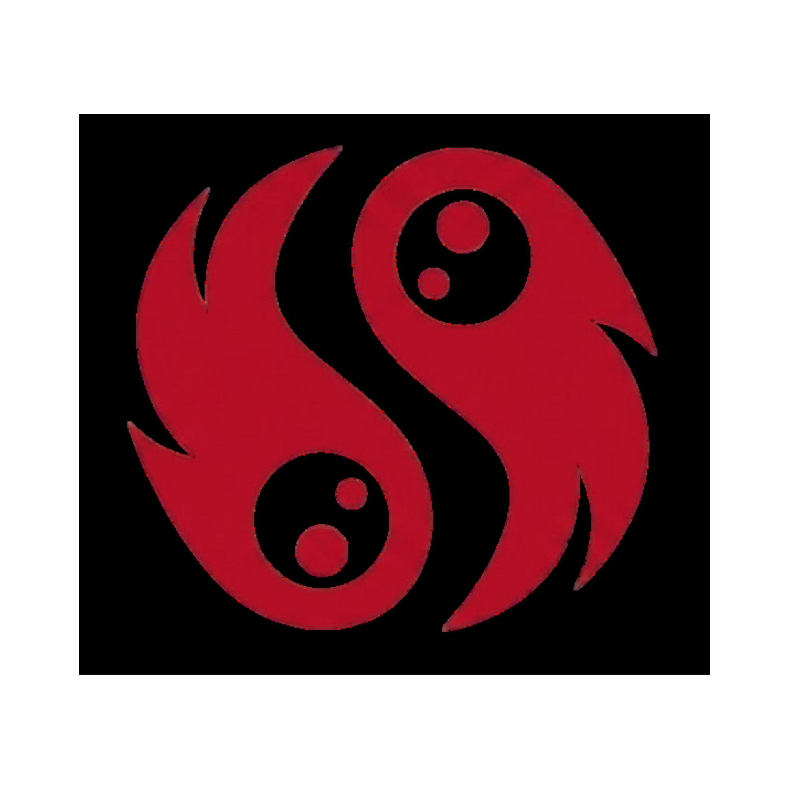
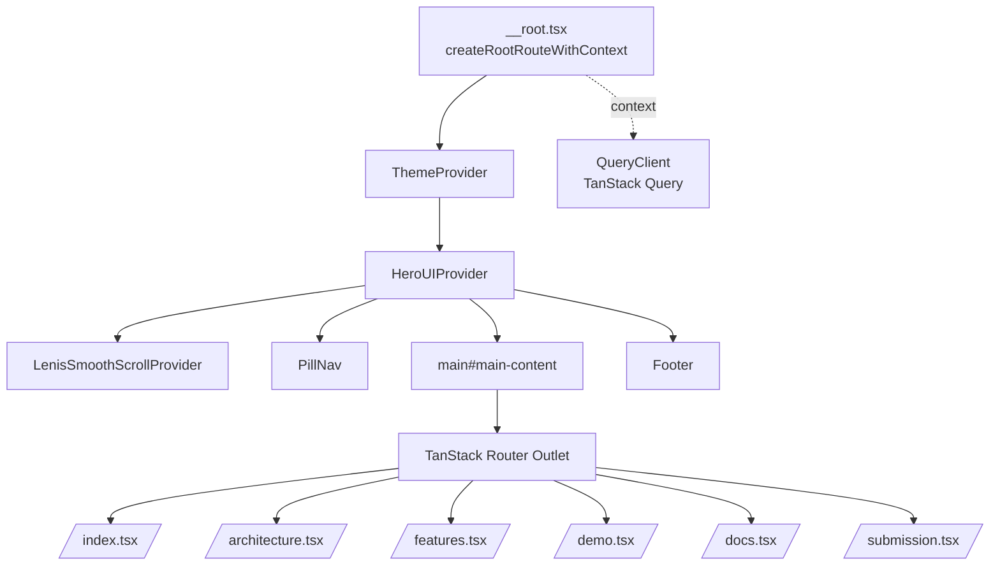
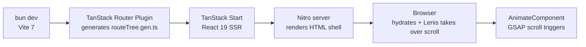

<div align="center">



# Curva Web

**The Curva pitch and documentation microsite for Tether Developers Cup 2026.**

Landing page, architecture explainer, demo walkthrough, features, docs, and submission
pages for the Curva peer-to-peer World Cup watch-party. This is the public-facing site
that judges land on. The actual Pear app lives in [`../pear-app/`](../pear-app/).

<sub>[What This Site Is](#what-this-site-is) · [Pages](#pages) · [Architecture](#architecture) · [How It Works](#how-it-works) · [Tech Stack](#tech-stack) · [Quick Start](#quick-start) · [Deployment](#deployment)</sub>

</div>

<p align="center">
  
  
  
  
  
  
  
  
  
  
  
  
  
</p>

---

## What This Site Is

Curva Web is a single job: convince judges in under five minutes that Curva ships all
three Tether Developers Cup pillars (Pears, WDK, QVAC) in one working peer-to-peer app.

It is a marketing plus reference microsite. Not the Curva app. The site walks visitors
through the pitch, the architecture, the live demo path, and links out to the DoraHacks
submission, demo video, and the Curva monorepo.

Content is code-driven: pillar summaries, evidence bullets, and route inventories are
hardcoded in the route files with citations pointing back to real paths in
[`../pear-app/`](../pear-app/) and [`../backend/`](../backend/), so anything a judge
reads on the site can be verified in the repo in one click.

---

## Pages

| Route | File | Purpose |
|---|---|---|
| `/` | `src/routes/index.tsx` | Landing. Hero, three pillar cards (Pears / WDK / QVAC), evidence bullets, CTAs. |
| `/architecture` | `src/routes/architecture.tsx` | System architecture: how the Pear app, WDK worklet, and QVAC SDK compose. |
| `/features` | `src/routes/features.tsx` | Feature breakdown: sync, tipping, translation, chat, clip sharing. |
| `/demo` | `src/routes/demo.tsx` | Demo walkthrough matching the recorded video. |
| `/docs` | `src/routes/docs.tsx` | Technical reference and integration notes. |
| `/submission` | `src/routes/submission.tsx` | DoraHacks submission bundle, links, hackathon meta. |

Root shell (`src/routes/__root.tsx`) provides `PillNav`, `Footer`, meta/OG tags, and the
provider stack for every page.

---

## Architecture

### Component tree



### Rendering pipeline



---

## How It Works

### File-based routing

TanStack Router discovers every `.tsx` file in `src/routes/` and writes
`src/routeTree.gen.ts` at dev and build time. Each page exports a `Route` created with
`createFileRoute('/path')({ component })`. To add a new page, drop a file. No manual
route registration.

The root route uses `createRootRouteWithContext<{ queryClient: QueryClient }>()` so
every route can pull the shared `QueryClient` off `Route.useRouteContext()`.

### Providers layer

Order matters. `ThemeProvider` sits outermost, then `HeroUIProvider` (needs the
`dark` class on `<html>`, already set), then `LenisSmoothScrollProvider` which
initialises Lenis once on mount so smooth scroll works everywhere.

`TanStackDevtools` mounts a floating panel in dev only, wiring the Router and Query
devtools.

### Design tokens

- Body: `bg-[#0a0a0a] text-[#f5f5f0]` on `<html class="dark">`.
- Fonts: Inter Variable (`@fontsource-variable/inter`), Playfair Display
  (`@fontsource/playfair-display`), and Urbanist via Google Fonts loaded from the
  root head links.
- Tailwind CSS 4 via `@tailwindcss/vite`, using the `@import "tailwindcss"` syntax
  in `src/styles.css`. Custom scrollbar and selection styles live in the same file.
- HeroUI 2.8 supplies `Button`, `Input`, `Modal`, and friends. Class merging uses
  `cnm()` from `src/utils/style.ts` (clsx + tailwind-merge).

### Animations

- **GSAP 3.14** powers scroll-triggered reveals via
  `src/components/elements/AnimateComponent.tsx`.
- **Lenis 1.3** runs a global smooth scroll loop.
- **Motion 12.25** (Framer Motion) is available for component-level animation.
- **Lucide React** for icons.

---

## Tech Stack

| Layer | Technology | Purpose |
|---|---|---|
| Framework | TanStack Start 1.132 | React 19 meta-framework, SSR-capable |
| Runtime | React 19.2 + React DOM 19.2 | UI runtime |
| Router | TanStack Router 1.132 (file-based) | Routing with generated tree |
| Server state | TanStack Query 5.66 | Fetching, caching, SSR hydration |
| Forms | TanStack Form 1.0 | Typed forms |
| Tables | TanStack Table 8.21 | Data grids in docs pages |
| UI kit | HeroUI 2.8 | Accessible React components |
| Styling | Tailwind CSS 4.0 + `@tailwindcss/vite` | Utility CSS |
| Animation | GSAP 3.14, Motion 12.25, Lenis 1.3 | Scroll, transitions, smooth scroll |
| Icons | Lucide React 0.561 | Icon set |
| Fonts | Inter Variable, Playfair Display, Urbanist | Typography |
| Env | `@t3-oss/env-core` 0.13 + Zod 4.1 | Typed env vars |
| Build | Vite 7.1, Nitro nightly | Bundler and SSR server |
| Language | TypeScript 5.7 (strict) | Type safety |
| Test | Vitest 3.0, Testing Library 16.2, jsdom 27 | Unit and component tests |
| Lint | ESLint (`@tanstack/eslint-config`), Prettier 3.5 | Style enforcement |
| Package manager | Bun 1.1+ | Install and scripts |

Full versions are pinned in [`package.json`](./package.json).

---

## Project Structure

```
web/
├── src/
│   ├── routes/                 # File-based pages (TanStack Router)
│   │   ├── __root.tsx          # Shell: providers, PillNav, Footer, meta
│   │   ├── index.tsx           # Landing with pillar cards
│   │   ├── architecture.tsx
│   │   ├── demo.tsx
│   │   ├── docs.tsx
│   │   ├── features.tsx
│   │   └── submission.tsx
│   ├── components/             # Site components (PillNav, Footer, ErrorPage, elements/)
│   ├── providers/              # HeroUIProvider, LenisSmoothScrollProvider, ThemeProvider
│   ├── hooks/                  # Custom React hooks
│   ├── utils/                  # style.ts (cnm), format.ts
│   ├── lib/                    # External integrations
│   ├── integrations/           # TanStack Query wiring, devtools
│   ├── config/                 # Site config
│   ├── config.ts               # App-wide constants and links
│   ├── env.ts                  # T3Env schema (server + client vars)
│   ├── router.tsx              # Router factory
│   ├── routeTree.gen.ts        # Generated by @tanstack/router-plugin
│   ├── styles.css              # Tailwind entry, tokens, scrollbar
│   └── logo.svg
├── public/                     # Static assets served at /
├── vite.config.ts              # Vite + Tailwind + Router plugin + Nitro
├── vercel.json                 # SPA rewrite for Vercel
├── tsconfig.json               # Strict TypeScript, @/ alias
├── eslint.config.js
├── prettier.config.js
└── package.json
```

---

## Quick Start

### Prerequisites

- **Bun 1.1+** (primary package manager and runner)
- **Node.js 20+** (Nitro and Vite runtime)

### Install

```bash
cd web
bun install
```

### Develop

```bash
bun run dev
```

Dev server runs on **port 3200**: <http://localhost:3200>.

Hot reload is on. The route tree regenerates automatically when you add or move a file
in `src/routes/`.

### Build

```bash
bun run build
```

Output lands in `.output/` (Nitro build). This is what gets deployed. Use `bun run build`, not `bun build`, so Bun runs the npm script instead of its built-in bundler.

### Preview

```bash
bun run preview
```

Serves the production build locally to sanity-check SSR before shipping.

---

## Commands

<details>
<summary><strong>All scripts</strong></summary>

| Command | What it does |
|---|---|
| `bun run dev` | Vite dev server on port 3200 |
| `bun run build` | Production build to `.output/` |
| `bun run preview` | Preview the production build |
| `bun run test` | Run Vitest suite |
| `bun run lint` | Run ESLint |
| `bun run format` | Run Prettier |
| `bun run check` | `prettier --write . && eslint --fix` |

</details>

---

## Deployment

**Vercel** is the default target. `vercel.json` rewrites every path to `/` so the
TanStack Router client picks up deep links after hydration. Push to `main`, Vercel
picks it up. Zero-config deploy: `vercel --prod` from `web/`.

**Any Node 20+ host** works too. Run `bun run build` and serve the resulting `.output/`
directory. Nitro produces a standard Node server entry.

Meta tags, OG image (`/assets/images/og.png`), and Twitter card are declared in
`src/routes/__root.tsx` inside the `head()` return.

---

## Environment Variables

Managed by `@t3-oss/env-core` in [`src/env.ts`](./src/env.ts). Vars are validated
with Zod at build time.

| Variable | Scope | Required | Purpose |
|---|---|---|---|
| `SERVER_URL` | server | optional | Backend origin used by SSR loaders |
| `VITE_APP_TITLE` | client | optional | Overrides the default document title |

To add a new variable, extend the schema in `src/env.ts` under `server` or `client`.
Client vars must be prefixed with `VITE_`. Empty strings are treated as `undefined`.

---

## Related

- [`../README.md`](../README.md), Curva monorepo overview
- [`../pear-app/`](../pear-app/), the actual Curva Pear app (Bare + Autobase + WDK + QVAC)
- [`../backend/`](../backend/), support services: QVAC catalog, x402 facilitator, seeder
- [`../SUBMISSION.md`](../SUBMISSION.md), DoraHacks submission text
- [`../DEMO_SCRIPT.md`](../DEMO_SCRIPT.md), walkthrough matching `/demo`

---

<div align="center">

**Tether Developers Cup 2026** · Pears track · Indonesia · Final **2026-07-15**

Built on the Kwek Labs Web Starter.

</div>

---

## Code review permalinks (web scope)

Direct response to the judges' semifinal brief. The web site does not wire the Tether SDKs directly (that lives in [`../pear-app/`](../pear-app/) and [`../backend/`](../backend/)) but it is the surface a judge lands on before opening any code. Every URL below is pinned to commit `517cff080a013ec94dece86c02a35821cab7e726` on `github.com/louissarvin/Curva` so line numbers never drift. Root README's [Tether stack integration in detail](../README.md#tether-stack-integration-in-detail) has the full "why chose / how wired / trade-off accepted" triple per package.

### Site routes — what each page explains

1. **Landing page** (product tagline, one-line pitch, primary CTA to the Pear DHT release): [`src/routes/index.tsx`](https://github.com/louissarvin/Curva/blob/517cff080a013ec94dece86c02a35821cab7e726/web/src/routes/index.tsx).
2. **Architecture** (mermaid diagrams for room join, tip flow, Bare worker; explains the three-surface story): [`src/routes/architecture.tsx`](https://github.com/louissarvin/Curva/blob/517cff080a013ec94dece86c02a35821cab7e726/web/src/routes/architecture.tsx).
3. **Features** (13 Pears building blocks + WDK components + QVAC pipelines): [`src/routes/features.tsx`](https://github.com/louissarvin/Curva/blob/517cff080a013ec94dece86c02a35821cab7e726/web/src/routes/features.tsx).
4. **Demo** (staged screenshots + the 90-second script narration): [`src/routes/demo.tsx`](https://github.com/louissarvin/Curva/blob/517cff080a013ec94dece86c02a35821cab7e726/web/src/routes/demo.tsx).
5. **Docs** (mini docs hub linking into ADRs, IPC surface, spec files): [`src/routes/docs.tsx`](https://github.com/louissarvin/Curva/blob/517cff080a013ec94dece86c02a35821cab7e726/web/src/routes/docs.tsx).
6. **Submission** (the same content the DoraHacks form takes): [`src/routes/submission.tsx`](https://github.com/louissarvin/Curva/blob/517cff080a013ec94dece86c02a35821cab7e726/web/src/routes/submission.tsx).
7. **Root layout + providers + meta tags**: [`src/routes/__root.tsx`](https://github.com/louissarvin/Curva/blob/517cff080a013ec94dece86c02a35821cab7e726/web/src/routes/__root.tsx).

### Design system + polish

8. **Global styles** (Tailwind 4 `@import "tailwindcss"`, custom scrollbar, dark theme): [`src/styles.css`](https://github.com/louissarvin/Curva/blob/517cff080a013ec94dece86c02a35821cab7e726/web/src/styles.css).
9. **Scroll-triggered animations** (GSAP-powered `AnimateComponent` used across every page): [`src/components/elements/`](https://github.com/louissarvin/Curva/blob/517cff080a013ec94dece86c02a35821cab7e726/web/src/components/elements/).
10. **Providers** (HeroUI theme, Lenis smooth-scroll, TanStack Query client): [`src/providers/`](https://github.com/louissarvin/Curva/blob/517cff080a013ec94dece86c02a35821cab7e726/web/src/providers/).
11. **Vite + Nitro config** (TanStack Start SSR + Vercel deployment): [`vite.config.ts`](https://github.com/louissarvin/Curva/blob/517cff080a013ec94dece86c02a35821cab7e726/web/vite.config.ts).

### Where in the pear-app / backend the site references

The site's job is to explain the code in the neighbouring subprojects. Every claim on the site lands on a specific block in the actual codebase:

- Landing page's "13 Pears primitives" claim → root README's [Pears table](../README.md#pears-primary-track-13-building-blocks) plus every row's embedded permalink.
- Architecture page's Bare-worker + Autobase story → [`pear-app/bare/room.js#L698-L961`](https://github.com/louissarvin/Curva/blob/517cff080a013ec94dece86c02a35821cab7e726/pear-app/bare/room.js#L698-L961) (Pattern B addWriter) and [`pear-app/bare/chat.js#L234-L318`](https://github.com/louissarvin/Curva/blob/517cff080a013ec94dece86c02a35821cab7e726/pear-app/bare/chat.js#L234-L318) (apply purity).
- Features page's "gasless USDT tip" screenshot → [`pear-app/bare/wallet/eip3009.js`](https://github.com/louissarvin/Curva/blob/517cff080a013ec94dece86c02a35821cab7e726/pear-app/bare/wallet/eip3009.js) + [`backend/src/routes/facilitatorRoutes.ts`](https://github.com/louissarvin/Curva/blob/517cff080a013ec94dece86c02a35821cab7e726/backend/src/routes/facilitatorRoutes.ts).
- Demo page's "voice-controlled coach" step → [`pear-app/bare/voiceCoach.js#L205-L235`](https://github.com/louissarvin/Curva/blob/517cff080a013ec94dece86c02a35821cab7e726/pear-app/bare/voiceCoach.js#L205-L235) (5-cap orchestration factory).
- Submission page's "on-device translation" bullet → [`pear-app/bare/translate.js`](https://github.com/louissarvin/Curva/blob/517cff080a013ec94dece86c02a35821cab7e726/pear-app/bare/translate.js).

## Tether stack usage (web scope)

The web site does not import `@tetherto/wdk`, `@qvac/sdk`, or `hyperswarm`. Those live in [`pear-app/`](../pear-app/) (client) and [`backend/`](../backend/) (companion). What the web project owns is the **public-facing explanation** of every Tether-stack piece Curva ships. The site is the marketing surface; the code lives in the two subfolders.

| Stack piece | Web page that explains it | Deep-dive lands in |
|---|---|---|
| **Pears** (13 primitives) | [`src/routes/features.tsx`](https://github.com/louissarvin/Curva/blob/517cff080a013ec94dece86c02a35821cab7e726/web/src/routes/features.tsx) + [`src/routes/architecture.tsx`](https://github.com/louissarvin/Curva/blob/517cff080a013ec94dece86c02a35821cab7e726/web/src/routes/architecture.tsx) | [Root README Pears table](../README.md#pears-primary-track-13-building-blocks) |
| **WDK** (EIP-3009 + smart-account fallback) | [`src/routes/features.tsx`](https://github.com/louissarvin/Curva/blob/517cff080a013ec94dece86c02a35821cab7e726/web/src/routes/features.tsx) + [`src/routes/demo.tsx`](https://github.com/louissarvin/Curva/blob/517cff080a013ec94dece86c02a35821cab7e726/web/src/routes/demo.tsx) | [Root README WDK table](../README.md#wdk-cameo-gasless-usdt-tips) |
| **QVAC** (5 baseline + orchestration flows) | [`src/routes/features.tsx`](https://github.com/louissarvin/Curva/blob/517cff080a013ec94dece86c02a35821cab7e726/web/src/routes/features.tsx) | [Root README QVAC table](../README.md#qvac-cameo-on-device-ai) |
| **Pear DHT release** (`pear://hcg8oft…`) | [`src/routes/index.tsx`](https://github.com/louissarvin/Curva/blob/517cff080a013ec94dece86c02a35821cab7e726/web/src/routes/index.tsx) (primary CTA) | [`pear-app/pear.json`](https://github.com/louissarvin/Curva/blob/517cff080a013ec94dece86c02a35821cab7e726/pear-app/pear.json) |
| **ADRs (10 total)** | [`src/routes/docs.tsx`](https://github.com/louissarvin/Curva/blob/517cff080a013ec94dece86c02a35821cab7e726/web/src/routes/docs.tsx) | [`docs/adr/`](https://github.com/louissarvin/Curva/blob/517cff080a013ec94dece86c02a35821cab7e726/docs/adr/) |

**Trade-off we accepted for the web scope**: we did NOT wire live data from the Companion backend into the site (no `TanStack Query` calls hitting `/pears/status`, `/qvac/models`, or `/wdk/relay/*`). Every number the site shows is a screenshot or a copy-paste at build time. The reason: the Companion runs on a laptop under our desk during the cup submission window. If we bind the site to a live endpoint that then goes offline, judges see a broken page and read that as broken product. Static values inside the routes stay correct even when the laptop is off. Post-cup we would wire live data via TanStack Query with a stale-while-revalidate cache.
